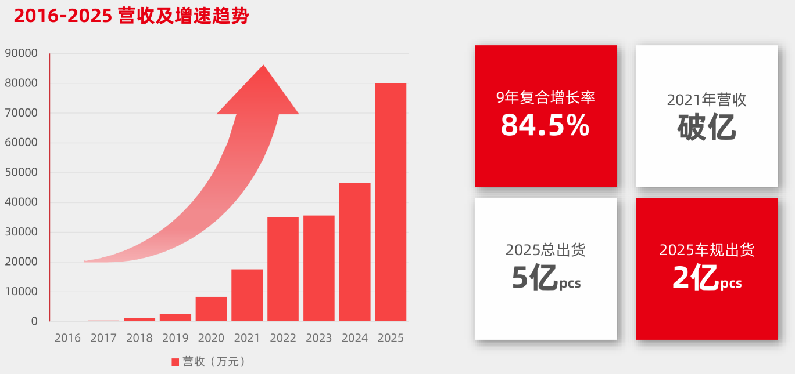

![5标志与中文校名组合规范 \[转换\]](./media/image1.png){width="3.3125in"
height="0.9284722222222223in"}

硕士研究生学位论文

  -----------------------------------------------------------------------
  题目：        模拟芯片国产替代战略路
  ------------- ---------------------------------------------------------
                径:以C公司为例

  -----------------------------------------------------------------------

  -----------------------------------------------------------------------
  姓 名：              王淳
  -------------------- --------------------------------------------------
  学 号：              2401221669

  院 系：              汇丰商学院

  专 业：              高级管理人员工商管理硕士

  研究方向：           （空着不填）

  导师姓名：           
  -----------------------------------------------------------------------

学术学位 专业学位

二〇二六年 月

版权声明

任何收存和保管本论文各种版本的单位和个人，未经本论文作者同意，不得将本论文转借他人，亦不得随意复制、抄录、拍照或以任何方式传播。否则，引起有碍作者著作权之问题，将可能承担法律责任。

# 摘要

在中美科技竞争常态化的背景下，半导体产业链的自主可控已成为关乎国家经济安全和国防安全的生命线。模拟芯片作为连接物理世界与数字世界的"感官"与"神经"，广泛渗透于国民经济与国防建设的各个领域。然而其国产化率较低，尤其在高端工业和汽车市场，仍被德州仪器（TI）、亚德诺（ADI）等国际巨头垄断。如何突破市场壁垒，实现从"技术可行"到"商业成功"的跨越，是当前产业界最紧迫的实践难题。

本论文通过对现有资料的梳理，发现国内外学者对半导体产业的研究多集中于宏观产业政策、技术追赶路径或企业财务绩效，而深入到某家公司层面，系统性地将战略布局进行分析，专门研究国产模拟芯片如何构建信任、突破市场的学术成果尚属空白。本研究针对该缺口，以公司战略的理论工具，解决国产替代中的核心痛点。

C公司成立于2016年，是一家专注于高端模拟芯片研发设计与销售的高科技公司，产品涵盖隔离与接口、驱动与电源、高性能模拟三大产品线以及uMic战略产品（
micro-Module in
Chip微型模组集成芯片）。目前产品已广泛应用于工业控制、电源能源、通讯与计算、汽车电子等领域。历经多年蓬勃发展，已然成为隔离、接口等高端模拟芯片领域的知名供应商，合作客户累计超过5000家。秉承"客户至上、志存高远、持续创新、完美极致、诚实守信"的价值观，C公司为全世界的客户提供多品类、高品质的模拟芯片。

本文将引用经典的PEST、波特五力模型分析宏观与行业环境、价值链、波士顿矩阵分析等战略理论。以C公司为例，通过拆解其内部后勤、生产运营、技术开发、人力资源等环节，结合模拟芯片行业的竞争特征，制定各环节的优化策略，最终构建企业的价值分析和核心竞争优势。探索在品牌弱势和技术追赶条件下有效的营销范式。为国产半导体领域尤其是模拟芯片的学术研究提供一个战略案例。研究表明本土模拟芯片设计公司需通过有效战略布局构建信任、实现市场突破的竞争战略。本研究可为其他国产模拟芯片公司提供一套关于市场定位、产品策略、品牌建设和生态构建的可操作对策建议。

关键词：模拟芯片，竞争战略，PEST分析，波特五力模型，价值链
，波士顿矩阵分析

ENGLISH TITLE

Author Name ( EMBA Program)

Supervised by Professor ......

# ABSTRACT

With the rapid development of China\'s economy and globalization, more
and more Chinese companies go to list overseas. Overseas capital markets
have become an important source of financing for Chinese companies.
However, since 2011, many Chinese stocks have delisted from overseas
markets. Some companies are no longer suitable for overseas capital
markets. It verified the importance of listed location.

KEYWORDS: Keyword 1, Keyword 2, Keyword 3

# 目录

[第一章 绪论 1](#_Toc108431350)

[1.1 研究背景和意义 1](#_Toc108431351)

[1.2 研究方法 3](#_Toc108431354)

[1.3 框架 5](#_Toc108431356)

[第二章 理论基础与文献综述 6](#_Toc108431357)

[2.1理论基础 7](#_Toc108431359)

[2.2文献综述 8](#_Toc108431359)

[第三章 C公司外部环境分析 9](#_Toc108431360)

[3.1 C公司外部宏观环境PEST分析 9](\l)

[3.1.1 政治环境 10](#_Toc108431352)

[3.1.2 经济环境 11](#_Toc108431353)

[3.1.3社会文化环境 13](#_Toc108431352)

[3.1.4 技术环境 15](#_Toc108431353)

[3.1.5 小结 16](#_Toc108431353)

[3.2行业总体环境分析 14](#_Toc108431359)

[3.2.1 行业总体情况 14](#_Toc108431352)

[3.2.2 主要对手分析 16](#_Toc108431353)

[3.3行业竞争环境波特五力分析 17](#_Toc108431359)

[3.3.1 现有企业间的竞争 17](#_Toc108431352)

[3.3.2 潜在进入者的威胁 18](#_Toc108431353)

[3.3.3 替代品的威胁 19](#_Toc108431352)

[3.3.4 供应商议价能力 20](#_Toc108431353)

[3.3.5 客户议价能力 21](#_Toc108431353)

[3.3.5 小结 22](#_Toc108431353)

[第四章 C公司内部环境 23](\l)

[4.1 C公司基本情况 23](#_Toc108431358)

[4.2 C公司内部资源和能力分析 24](#_Toc108431358)

[4.3 C公司竞争战略](#_Toc108431359) 32

[4.3.1 C公司战略目标 17](#_Toc108431352)

[4.3.2 C公司基本价值链的分析和实施路径 18](#_Toc108431353)

[4.4 C公司面临的挑战 25](#_Toc108431358)

[第五章 C公司竞争战略选择 29](#_Toc108431363)

[5.1 SWOT分析](#_Toc108431359) 33

[5.1.1 Strengths优势分析 33](#_Toc108431352)

[5.1.2 Weakness劣势分析 33](#_Toc108431352)

[5.1.3 Opportunity机遇分析 33](#_Toc108431352)

[5.1.4 Threat威胁分析 33](#_Toc108431352)

[5.1.5 小结(SO,ST,WO,ST) 37](#_Toc108431353)

[5.2 波士顿矩阵分析](#_Toc108431359) 39

[5.2.1 波士顿矩阵分析 39](#_Toc108431352)

[5.2.2 小结 41](#_Toc108431353)

[5.3 战略选择](#_Toc108431359) 42

[第六章 C公司战略实施的措施保障（需按SWOT来对应解决是否按以下内容写）
43](#_Toc108431363)

[6.1 技术资源 44](#_Toc108431358)

[6.2 运营资源 46](#_Toc108431359)

[6.3 客户资源](#_Toc108431359) 48

[6.4 人力和社会资源 49](#_Toc108431359)

[6.5 财务资源](#_Toc108431359) 49

[6.6 小结](#_Toc108431359) 53

[第七章 研究结论与展望 54](#_Toc108431363)

7[.1 研究结论 56](#_Toc108431358)

7[.2 研究不足与展望 58](#_Toc108431358)

[参考文献 61](#_Toc108431364)

[附录A 附录示例 62](#_Toc108431365)

[致谢 64](#_Toc108431366)

[北京大学学位论文原创性声明和使用授权说明 65](#_Toc108431367)

第一章 绪论

1.1 研究背景和意义

近年来，全球半导体产业进入深度调整与重构阶段，地缘政治冲突、国际贸易壁垒、供应链区域化等因素加速了全球芯片产业格局的变化。在这一背景下，模拟芯片作为电子信息产业的核心基础元器件，其战略重要性愈发凸显。模拟芯片广泛应用于工业控制、汽车电子、通信、消费电子、新能源等关键领域，是现代工业体系中不可或缺的"基石性"产品。全球模拟芯片市场规模已超过千亿美元，随着新能源汽车、储能、工业自动化、AI算力等新兴产业的快速发展，高端模拟芯片需求呈现爆发式增长，尤其是工业和车规级隔离芯片、隔离驱动、高集成电源管理、高精度信号链芯片等产品，市场增速显著高于行业平均水平。

目前，全球模拟芯片市场高度集中，德州仪器TI和亚德诺ADI国际巨头占据超过60%的市场份额，在高端工业、车规、通信等领域形成了多重壁垒。国内模拟芯片企业虽然数量众多，但整体规模偏小、产品以中低端为主，高端市场国产化率不足20%，供应链安全面临严峻挑战。面对日益复杂的国际环境，中国政府将集成电路产业提升至国家战略高度，出台了包括大基金、税收优惠、车规芯片专项扶持等一系列措施，推动国产芯片实现自主可控。同时，下游终端企业（如新能源汽车、工业控制、储能厂商）主动开放供应链，为国产模拟芯片提供了前所未有的验证与量产机会。

C公司作为国内领先的高端模拟芯片设计企业，在隔离与接口、驱动与电源、高集成模拟芯片等领域具备较强的技术积累和市场竞争力。公司产品已进入汇川技术、比亚迪、宁德时代等头部客户供应链，工业和车规芯片出货量快速增长。然而，面对国际巨头的竞争压力、技术迭代加速、供应链不确定性增加等挑战，公司需要进一步明确战略方向，优化产品结构，提升核心竞争力。

本论文基于战略管理理论，结合模拟芯片行业特点，对C公司的外部环境、内部资源能力、竞争格局及战略路径进行系统分析。模拟芯片行业具有技术壁垒高、产品生命周期长、客户认证周期长、供应链复杂等特点，现有战略管理研究对该行业的针对性不足。通过PEST、波特五力、SWOT、波士顿矩阵等工具，构建适用于模拟芯片企业的战略分析框架，为行业内其他企业提供理论参考，帮助企业明确自身优势与短板，识别外部机遇与威胁，为公司未来三到五年的产品规划、研发投入、市场拓展和供应链布局提供决策依据。

模拟芯片产业的发展离不开晶圆代工、封测、设备材料等上下游企业的协同。本论文在分析企业战略的同时，也关注产业链协同问题，为推动国内模拟芯片产业链整体升级提供参考。对行业趋势、企业能力与战略需求的分析，可为政府制定产业政策、产业基金进行投资决策提供依据，有助于推动更多资源向高端模拟芯片领域集中，加速国产替代进程。

因此，在全球半导体产业重构、国产替代加速、高端模拟芯片需求爆发的背景下，对C公司进行系统的战略研究具有重要的理论价值和现实意义。本论文不仅能够为企业自身的战略制定提供科学依据，也将为推动中国模拟芯片产业的自主可控和高质量发展提供有益参考。

1.2 研究方法

为了系统全面地分析C公司的战略环境与发展路径，本研究综合运用多种战略管理研究方法，结合模拟芯片行业特点与企业实际情况，形成从外部环境分析、行业竞争分析、企业内部分析到战略选择与路径设计的完整研究框架。通过理论与实践相结合的方式，全面分析C公司的战略环境与发展路径，确保研究结论的科学性、系统性与可操作性。主要研究方法如下：

（1）文献研究法

通过查阅国内外关于半导体产业、模拟芯片行业、企业战略管理等领域的学术论文、行业报告、政策文件、企业年报及权威数据库，系统梳理行业发展趋势、技术演进路径、政策支持体系以及国内外标杆企业的战略实践。文献研究为后续的PEST分析、波特五力分析、SWOT分析等提供理论基础和数据支撑，确保研究的科学性与可靠性。

（2）PEST分析法

从政治（Political）、经济（Economic）、社会（Social）、技术（Technological）、环境（Environmental）、法律（Legal）六个维度，对模拟芯片行业所处的宏观环境进行系统分析。通过识别宏观环境中的关键影响因素，明确行业发展的机遇与威胁，为C公司的战略制定提供外部依据。

（3）波特五力模型分析法

运用波特五力模型，从现有竞争者的竞争程度、潜在进入者的威胁、替代品的威胁、供应商的议价能力、客户的议价能力五个方面，分析模拟芯片行业的竞争结构与竞争强度。通过五力分析，识别行业的关键竞争压力点，为C公司制定竞争战略、构建竞争优势提供依据。

（4）SWOT分析法

结合企业内部资源与能力，从优势（Strengths）、劣势（Weaknesses）、机遇（Opportunities）、威胁（Threats）四个维度，对C公司的内外部条件进行综合分析。通过SWOT矩阵匹配，形成SO、WO、ST、WT四类战略组合，为企业战略选择提供清晰方向。

（5）波士顿矩阵分析法

以市场增长率和相对市场份额为维度，将C公司的主要产品线划分为明星产品、现金牛产品、问题产品和瘦狗产品，明确各产品线的战略定位与资源配置优先级。波士顿矩阵为企业产品组合优化、研发投入决策、市场拓展策略提供重要依据。

1.3 框架

（不会写。。。）

第二章 理论基础与文献综述

2.1 理论基础

本文以企业战略管理核心理论为支撑，结合半导体行业发展特性，融合波特经典战略分析理论、产业价值链理论、核心竞争力理论，构建从外部环境分析到内部能力拆解，以及战略匹配制定和实施路径落地的完整研究体系，为C公司的战略发展分析提供科学、系统的理论依据与方法指导。以下为本文核心依托的理论内容与应用逻辑：

（1）波特经典战略分析理论

波特战略理论是本文开展外部环境、行业竞争及企业内部价值分析的核心框架，涵盖波特五力模型、价值链分析理论与基本竞争战略理论三大核心内容，三者相互支撑，构成企业战略分析的基础体系。

（2）企业内外部环境综合分析理论

企业战略的制定需以对自身内外部环境的系统分析为前提，PEST模型与SWOT分析模型是经典的内外部环境分析工具，二者形成宏观环境和综合匹配的分析逻辑，为战略备选方案的制定提供依据。

（3）产品组合与资源配置理论

波士顿矩阵理论是企业产品组合分析与资源优化配置的经典工具，由波士顿咨询集团于1970年提出，为企业制定产品战略、合理分配研发、产能、营销等资源提供量化依据。该理论以市场增长率和相对市场份额为核心维度，将企业产品划分为明星产品、现金牛产品、问题产品、瘦狗产品四大象限，不同象限产品对应不同的战略定位与资源配置策略。本文运用该理论分析C公司的产品组合结构，明确各产品线的战略定位，指导企业将资源向高增长、高市场份额的明星产品倾斜，同时实现现金牛产品的利润最大化、问题产品的选择性培育与瘦狗产品的低效资源剥离，优化企业产品组合与资源配置效率。

本文所依托的各类理论并非孤立存在，而是形成一个层层递进、相互协同的完整战略分析体系，其核心应用逻辑为，以国产替代背景下的科技企业发展理论为宏观指引，明确研究的行业背景与核心方向；运用PEST模型与波特五力模型完成企业外部环境分析，识别宏观机遇与行业竞争压力；依托价值链分析理论与核心竞争力理论拆解企业内部资源与能力，明确核心优势与发展短板；通过SWOT分析模型整合内外部环境分析结果，完成战略匹配与备选方案制定；结合波士顿矩阵理论完成产品组合与资源配置分析，为战略方案提供具体的产品与资源支撑；以波特基本竞争战略理论为最终指引，筛选确定C公司的核心竞争战略，并制定针对性的实施路径与保障措施。各类理论的协同应用，确保本文对C公司战略发展的分析既符合战略管理的经典逻辑，又贴合模拟芯片行业的产业特性与企业发展实际，使研究结论与战略建议具备科学性、系统性与可操作性。

2.2 文献综述

核心数据来源2024年实际值综合QYResearch《2026-2032全球及中国隔离器芯片行业研究报告》、百谏方略（DIResearch）隔离器芯片市场调研数据测算；2025-2026年预测值参考QYResearch、格隆汇行业报告披露的CAGR增速推导，贴合行业发展趋势。

第三章 C公司外部环境分析

3.1 C公司外部宏观环境PEST分析

3.1.1 政治环境

在产业政策扶持方面，国家高度重视半导体产业自主可控，将高端模拟芯片、车规芯片列为
"卡脖子"
领域重点攻关方向。集成电路产业大基金三期，规模约3440亿元，重点投向高端模拟、车规芯片研发与量产，为企业提供资金支持。以上海、深圳为核心的地方政府近年出台首台套补贴、研发退税、场景验证优先等政策，降低企业基建投入成本。同时，"十五五"
规划明确提出超常规推动集成电路产业发展，芯片国产替代专项激励政策持续落地，为C公司uMic微型模组高集成系列芯片和功能安全隔离驱动等明星产品的研发迭代、市场推广提供了良好的政策环境，加速其替代德州仪器（TI）、亚德诺（ADI）等国际厂商的进程。此外，国内对半导体产业链协同发展的政策引导，推动晶圆代工、封测、EDA工具等上下游企业协同创新，为构建自主可控供应链提供了政策支撑。在地缘政治与贸易壁垒方面，全球贸易格局重构带来一定挑战。国内针对关键半导体材料、设备的反制措施逐步落地，推动供应链内循环建设，叠加全球供应链区域化重构趋势，同时，下游终端企业主动开放国产芯片供应链，间接加速了C公司模拟类芯片的国内市场份额提升。但海外市场拓展，尤其是欧洲和北美市场，企业应对不同国家的贸易规则、技术壁垒，合规成本显著增加，面临一定的市场准入风险。

3.1.2 经济环境

从行业增长与资本环境来看，模拟芯片行业整体保持高速增长态势，2026
年全球模拟芯片市场规模预计增长
26%，其中汽车电子、储能、算力电源等高端细分领域增速高达
30%-40%，与C公司明星产品、潜力问题产品的布局高度契合，为uMic高集成系列、车规隔离驱动等产品提供了广阔的市场空间，预计此类明星产品营收增速可维持
50%
以上。国内半导体行业资本支出呈现分化态势，中低端模拟芯片融资热度降温，而高端模拟芯片领域融资需求旺盛，为C公司驱动与电源产品线的技术突破和产能扩张提供了便利的资本环境。但同时，全球8英寸晶圆产能持续紧张，晶圆代工价格稳中有升，导致公司现金牛产品（隔离与接口产品线）的生产成本承压，利润率面临一定压缩，对企业供应链成本优化能力提出更高要求。

从下游需求韧性来看，C公司聚焦的工业控制、汽车电子、储能等核心领域，需求呈现强刚性特征，能够有效穿越消费电子行业周期波动的影响。工业控制领域向自动化、智能化升级，对高可靠性隔离、驱动芯片需求持续稳定；汽车电子领域（尤其是新能源汽车）向电动化、智能化转型，主驱、电池管理等场景催生大量车规芯片需求；储能领域迎来爆发式增长，光伏逆变器、储能变流器等设备对高集成、低功耗模拟芯片需求激增。此外，下游客户对隔离、驱动和电源一体化系统解决方案的需求日益增长，能够有效提升产品附加值，助力C公司依托uMic高集成技术打造系统级产品，提高客户粘性，同时推动现金牛产品与问题产品的协同发展，拓展应用场景。

3.1.3社会文化环境

在国产化认知方面，随着国内半导体产业自主可控理念的深入，下游终端企业，尤其是工业和汽车领域的头部企业，对国产芯片的认可度显著提升，高端应用场景对国产芯片的验证意愿和导入力度持续加大，有效降低了C公司明星产品的市场教育成本，加速了进口替代进程。同时，"专精特新"
企业在资本和市场等领域的认可度不断提高。C公司作为国家级专精特新重点"小巨人"
企业，能够凭借这一品牌和荣誉优势，吸引更多产业资本合作，拓展优质客户群体，进一步扩大市场影响力。

在人才供给方面，国内高校纷纷扩招集成电路相关专业，加大模拟芯片领域人才培养力度，高端模拟芯片设计、测试、研发人才的供给量逐步增加，一定程度上缓解了企业长期面临的人才缺口问题，为C公司技术迭代、产品研发、产能扩张提供了人才支撑。同时，行业人才流动加剧，国际巨头的资深工程师逐步向国内优质企业回流，助力企业弥补高端技术人才短板，提升核心研发能力。

在安全与合规意识方面，随着工业控制、汽车电子等领域的安全性要求不断提升，下游客户对芯片的功能安全、信息安全、可靠性以及长期供货能力的关注度显著提高，成为企业进入高端市场的核心门槛。车规领域对功能安全等级（ASIL-B/D）的要求、工业领域对产品可靠性的标准，倒逼企业加大安全认证投入，提升产品质量管控水平。这一趋势对C公司而言，既是机遇也是挑战。重点研发产品及产品路径契合市场安全需求，竞争力进一步凸显。

3.1.4 技术环境

技术因素是模拟芯片行业竞争的核心，主要体现在技术迭代趋势、国产产业链技术突破、专利竞争加剧三个方面，直接影响C公司的技术壁垒、产品竞争力与市场布局。在技术迭代方面，模拟芯片行业呈现高集成、功能安全、低功耗的主流发展趋势，uMic多die集成技术、高压隔离技术、功能安全技术成为企业构建差异化优势的核心抓手。C公司聚焦的
uMic高集成技术，契合降本、缩体积、简设计的市场痛点，已形成一定的技术壁垒，能够有效支撑明星产品的市场竞争力；同时，功能安全、低功耗技术的持续迭代，推动车规、工业高端场景的产品升级，为企业明星产品、问题产品的技术突破提供了方向，有助于缩小与国际巨头的技术代差。

在国产产业链技术突破方面，国内晶圆代工厂中芯国际的
BCD（双极型CMOS-DMOS集成）工艺日趋成熟，封测企业长电科技的技术水平持续提升，核心设备和关键材料的国产化率逐步提高。这一趋势不仅降低了C公司对国际供应链的依赖，减少了先进制程设备和材料进口受限带来的风险，还通过协同创新，加速了高集成产品的良率提升与成本优化，为问题产品的技术突破和产能扩张提供了支撑，同时降低了企业的研发和生产投入成本。

在专利竞争方面，国内模拟芯片企业的专利布局加速，隔离、驱动、电源管理等细分领域的专利纠纷日益增多，行业专利保护力度不断加大。国际巨头凭借数十年的技术积累，构建了严密的专利壁垒，通过专利诉讼等方式限制国产厂商的市场拓展，尤其是海外市场布局过程中，国产公司面临一定的专利侵权风险。同时，国内企业纷纷加大核心专利布局力度，C公司自主研发的隔离技术、uMic微型模组集成芯片、车规级隔离驱动等核心成果，虽能通过专利保护构建技术护城河，但也需持续加强专利布局的全面性与全球化，避免侵权风险，提升行业话语权。

3.1.5 小结

整体来看，C公司面临的外部宏观环境呈现
机遇大于挑战的格局。政治上，产业政策扶持为企业发展提供了良好支撑，地缘政治壁垒倒逼企业推进供应链自主可控；经济上，行业高增长、下游需求强韧性为企业营收增长提供了保障，资本环境分化推动企业聚焦高端领域；社会上，国产化认知提升、人才供给优化为企业发展提供了基础，安全合规意识增强提高了行业准入门槛；技术上，技术迭代趋势契合企业产品布局，国产产业链技术突破降低了企业对外依赖，专利竞争加剧倒逼企业强化技术创新与专利布局；环境上，绿色低碳要求推动企业产品升级，可持续供应链建设增加了企业运营复杂度；法律上，行业法规与认证规范了企业经营，知识产权保护为企业技术创新提供了保障。

C公司立足自身核心优势，精准把握外部机遇，规避潜在风险：依托政策与技术红利，强化明星产品的技术壁垒；借助下游需求韧性，深挖现金产品的盈利潜力，培育问题产品的细分优势；顺应绿色低碳、合规发展趋势，优化产品结构与供应链布局；应对地缘政治、专利竞争等风险，推进供应链自主化与专利全球化布局，实现企业持续健康发展，支撑高端模拟芯片国产替代战略落地。

3.2行业总体环境分析

3.2.1 行业总体情况

全球模拟芯片市场呈稳健复苏态势，中国市场增速显著高于全球，高端细分领域如车规、AI算力、工业均成为增长核心引擎。全球市场2026
年预计同比增长5.1%-9.4%，规模突破千亿美元，AI服务器、新能源汽车等领域带动高端模拟芯片增速达30%-40%；国际巨头如TI和ADI率先对工业、车规产品涨价，推动行业进入量价齐升周期。中国市场2024
年规模约1953亿元，2026年有望突破3000亿元，年复合增长率维持12%以上，远超全球平均水平，国产替代与下游需求升级是核心驱动力。C公司所关联的隔离与接口、高集成系列、功能安全隔离驱动等产品契合高端增长赛道，预计营收增速维持50%以上，隔离与接口通用模拟芯片产品依托国产替代保持15%以上稳定增长。

表3-1 全球与中国模拟芯片市场规模及增速对比表（2024-2026年）

  -----------------------------------------------------------------------------------------------
  **市场维度**         **2024年规模**   **2025年预测规模**   **2026年预测规模**   **2024-2026年
                                                                                  CAGR**
  -------------------- ---------------- -------------------- -------------------- ---------------
  全球模拟芯片         796 亿美元       822-856亿美元        864-920亿美元        8.7%-10.5%

  中国全品类模拟芯片   3175.8 亿元      3500亿元             3300-3500亿元        10%-15%

  中国信号链和         1953 亿元        2400亿元             3000亿元             12.80%
  电源管理                                                                        
  -----------------------------------------------------------------------------------------------

表3-2 全球与中国模拟芯片"隔离+"市场规模及增速对比表（2024-2026年）

  --------------------------------------------------------------------------------------------------------------------------------------------------------------------------------------------------------------------------------------------------------------------------------------------------------
  区域   市场规模（亿美元）                                                同比增速（%）                                               2024-2026年CAGR（%）          核心因素
  ------ --------------------- --------------------- --------------------- ----------------------------- ----------------------------- ----------------------------- -------------------------------------------------------------------------------------------------------------------------------------
         2024年实际            2025年预测            2026年预测            2025年预测                    2026年预测                                                  

  全球   38.2                  44.1                  50.4                  15.4                          14.3                          14.8                          工业自动化、新能源汽车、AI服务器高压供电架构需求爆发；TI、ADI等巨头启动涨价周期，叠加技术迭代推动产品升级

  中国   12.2                  15.1                  18.5                  23.8                          22.5                          23.1                          国产替代加速（2024年国产化率不足30%），纳芯微、思瑞浦等本土企业放量；新能源汽车800V平台普及、光伏储能需求增长，政策支持半导体自主化

  　     中国占全球比重31.9%   中国占全球比重34.2%   中国占全球比重36.7%   中国增速较全球高8.4个百分点   中国增速较全球高8.2个百分点   中国CAGR较全球高8.3个百分点   中国为全球"隔离+"市场核心增长极，本土企业研发投入高（研发费率23%-32%），聚焦中高端市场突破，逐步挤压国际巨头份额
  --------------------------------------------------------------------------------------------------------------------------------------------------------------------------------------------------------------------------------------------------------------------------------------------------------

3.2.2 主要对手分析

模拟芯片中的"隔离+"赛道呈现国际巨头垄断高端而本土企业突围中低端的分层格局，竞争焦点从性价比转向技术壁垒、产品多维与系统解决方案能力。

表3-3 模拟芯片中的"隔离+"赛道企业概览

  ------------------------------------------------------------------------------------------------------------------------------------------------------------------------------------------------------------------------------------------------------------------------------------------------------------
  **竞争梯队**   **代表企业**                 **核心优势**                                                                                                                                          **市场定位**                           **C公司的竞争压力**
  -------------- ---------------------------- ----------------------------------------------------------------------------------------------------------------------------------------------------- -------------------------------------- -------------------------------------------------------------------
  第一梯队       TI、ADI(美股上市)            年营收30亿美元以上，全品类矩阵、车规及工业认证齐全、IDM 模式保障产能                                                                                  高端工业、车规、AI 算力，毛利率        技术专利壁垒高，客户粘性强，高端市场替代难度大
                                                                                                                                                                                                    60%-80%                                

  第二梯队       纳芯微、思瑞浦(科创板上市)   纳芯微年营收20亿人民币以上，思瑞浦3亿人民币以上，信号链、电源管理布局完善；IPO企业,资金成本低                                                         中高端工业、消费电子，毛利率 40%-50%   产品同质化竞争加剧，价格战压缩利润空间

  第三梯队       C公司、荣派、数明(非上市)    C公司年营收8亿人民币，细分领域技术突破（如隔离、uMic集成），聚焦车规和工业；荣湃和数明年营收2亿人民币以内，有海外大厂研发背景，在国内市场拓展较早。   车规隔离、工业驱动等细分赛道，毛利率   需快速IPO上市或有效并购打开知名度；突破单一产品限制；扩大客户群体
                                                                                                                                                                                                    35%-45%                                
  ------------------------------------------------------------------------------------------------------------------------------------------------------------------------------------------------------------------------------------------------------------------------------------------------------------

3.3行业竞争环境波特五力分析

模拟芯片行业因技术壁垒高、产品生命周期长、应用场景分散等特性。基于波特五力模型，结合C公司的业务布局与资源能力，从五大维度系统分析行业竞争强度与企业面临的竞争压力，具体如下：

3.3.1 现有企业间的竞争

德州仪器（TI）和亚德诺（ADI）等国际巨头占据全球 60% 以上市场份额，凭借
50 年以上技术积累、超 10
万项专利储备、全场景产品矩阵，如TI的电源管理芯片、ADI
的信号链芯片形成绝对壁垒。国内模拟芯片企业超
200家，多数集中在电源管理、通用接口等中低端领域，产品同质化严重，价格战激烈，部分产品价格较国际品牌低10%-30%，导致行业平均毛利率从2019年的45%降至2025年的32%。少数国产高端突围品牌有纳芯微、思瑞浦、数明等。

3.3.2 潜在进入者的威胁

模拟芯片行业的高壁垒导致潜在进入者威胁较低，核心壁垒集中在技术、资金、客户、供应链四大维度。技术壁垒有核心技术如高精度模拟电路设计、高压隔离工艺、功能安全算法需5-10
年积累，国际巨头已形成严密专利网，新进入者面临高额研发投入，高端领域年均需2-5
亿元与专利侵权风险；资金壁垒有研发投入、晶圆代工合作、产能储备需亿元级资金，且车规和高端工业领域认证周期长，普遍一年以上，初期订单不足难以获得代工厂优先产能，中小初创企业难以承受；客户壁垒方面，下游客户如汽车电子Tier1厂商对供应商认证严苛，需通过AEC-Q100、ISO26262等标准，新进入者难以快速获取优质客户资源，C公司等头部企业已积累5000家以上合作客户，进一步抬高客户壁垒；供应链壁垒方面，晶圆代工厂如台积电和中芯国际优先保障大客户产能，新进入者面临产能短缺风险。

3.3.3 替代品的威胁

模拟芯片的核心功能是物理信号与数字信号的转换，整体替代品威胁较低，但局部技术迭代与功能集成带来一定替代风险。如数字芯片集成模拟功能：主控芯片MCU/
FPGA集成简单模拟模块：人工智能算法可模拟部分模拟芯片功能，主要应用于通信、测试仪器领域，但技术成熟度不足，实时性、稳定性难以满足工业控制、汽车电子的严苛要求，威胁较低。集成化模块（SiP）可将多颗模拟芯片和数字芯片封装为模块，如电源管理模块，替代单颗模拟芯片，对C公司的uMic高集成产品形成替代与被替代的双重关系，因uMic本身属于集成化模块，可反制替代风险，但需持续技术升级应对更高集成度需求。

3.3.4 供应商议价能力

模拟芯片企业的供应商主要包括晶圆代工厂、封装测试厂、设备材料供应商，议价能力因行业格局和合作模式而异。其中逐一分析：

（1）晶圆代工厂：全球寡头垄断（台积电、中芯国际、格芯占全球 70%
产能），高端工艺40nm及以下议价权高，C公司的隔离与接口，以及uMic高集成产品使用中芯国际和东部高科的成熟180nm
工艺，供应商竞争相对充分，未来与更多厂家如华虹宏力、粤芯的新建12寸晶圆厂合作可降低议价压力。

（2）封装测试厂：国内长电科技、通富微电、华天科技占国内 60%
产能，竞争充分，议价权较低。C公司的芯片主要采用SOIC贴片成熟通用封装，选择较多。

（3）设备材料供应商：模拟类芯片主要使用普通材料（封装基板、引线框架）国内供应充足，议价权低。

3.3.5 客户议价能力

下游客户主要包括工业控制、汽车电子、泛能源和智慧家庭四大领域的制造商，客户议价能力因规模、产品重要性而异：

（1）大型终端制造商：华为、汇川技术、宁德时代、比亚迪等客户采购量大（单次采购千万级芯片），占C公司营收的40%，具有较强议价权，可通过多供应商比价、长期协议压价，部分要求定制化产品，如为比亚迪开发车规级专用芯片，还会提出严苛的交付周期如8
周以内与更长质保年限要求。

（2）中小型终端制造商：采购量小，单次采购数万至数十万级芯片，对价格敏感，切换成本低。普通模拟芯片替代周期3个月左右，议价权中等，重点关注产品性价比与技术支持响应速度。

（3）渠道商：C公司在行业建立的渠道商有一级代理商、二级代理商、方案商，如信和达、天河星、北高智等渠道商批量采购、覆盖多客户，依赖芯片企业的产品竞争力，议价权较弱，但大型渠道商可通过采购量争取10%-15%的价格优惠。

3.3.5 小结

模拟芯片行业呈现高竞争、高壁垒、低替代的核心特征，C公司的核心机遇在于潜在进入者威胁低，为巩固细分市场提供窗口期；uMic高集成产品既规避替代品威胁，又形成差异化竞争优势。未来需通过技术专利化、供应链多元化、客户深度绑定、产品差异化四大路径，对现有企业竞争与供需两端议价压力，在国产替代浪潮中实现从细分领先到全球主流供应商的跨越。

表3-4 C公司波特五力模型总结

  ------------------------------------------------------------------------------------------------------------------------------------------------------------------------------
  **竞争维度**       **强度评分      **核心结论**                                         **C公司应对策略**
                     （满分5分）**                                                        
  ------------------ --------------- ---------------------------------------------------- --------------------------------------------------------------------------------------
  现有企业间的竞争   4.8 分          行业竞争激烈，国际巨头垄断高端，国内企业中低端内卷   聚焦隔离与接口、uMic高集成细分领域，强化技术差异化；深化标杆客户绑定，避免正面价格战

  潜在进入者的威胁   2.0 分          技术、资金、客户、供应链壁垒高，威胁较低             加快专利布局（目标 200 项核心专利），巩固技术与客户壁垒；深化供应链协同，提升进入门槛

  替代品的威胁       2.3 分          整体威胁较低，局部集成化、宽禁带替代风险存在         持续升级uMic高集成技术，拓展功能安全、宽禁带适配能力；布局新兴领域专用芯片

  供应商议价能力     3.3 分          高端工艺、核心设备供应商议价权高                     多供应商备份 + 长期协议绑定；推进国产供应链替代，降低国际依赖

  客户议价能力       3.7 分          大型客户议价权强，中小型客户价格敏感                 定制化方案 + 联合研发绑定大型客户；高性价比 + 快速服务覆盖中小型客户
  ------------------------------------------------------------------------------------------------------------------------------------------------------------------------------

第四章 C公司内部环境

4.1 C公司基本情况

C公司成立于2016年，是一家专注于高端模拟芯片研发设计与销售的高科技公司，产品涵盖隔离与接口、驱动与电源、高性能模拟三大产品线以及uMic战略产品。目前产品已广泛应用于工业控制、电源能源、通讯与计算、汽车电子等领域。历经多年蓬勃发展，已然成为隔离、接口等高端模拟芯片领域的知名供应商，合作客户累计超过5000家。秉承"客户至上、志存高远、持续创新、完美极致、诚实守信"的价值观，C公司为全世界的客户提供多品类、高品质的模拟芯片。公司使命为共创卓越中国芯，为全球客户提供自主可控、高品质的模拟芯片解决方案，赋能产业升级与美好芯时代。即以技术创新为根基，打造性能卓越、自主可控的国产模拟芯片，打破进口依赖。价值导向为既聚焦国内电子信息制造企业的进口替代需求，提供质高价惠的产品；也面向全球客户输出高品质解决方案，兼顾本土责任与全球视野。通过全供应链国产化布局、场景化产品创新，为工业控制、汽车电子、泛能源等领域提供稳定可靠的模拟类核心元器件支撑。

公司愿景为成为全球一流、全品类覆盖的模拟芯片设计制造企业，跻身全球TOP10模拟芯片供应商行列。长期目标以15年战略规划为牵引，构建设计、制造、封测一体化能力，实现从细分领域领先到全模拟品类覆盖的跨越。行业地位目标是摆脱替代者标签，成为国际市场认可的主流模拟芯片供应商，在技术标准制定中拥有话语权，形成技术、产品、服务协同的全球模拟芯片生态。

公司定位为高端模拟芯片国产化领军者，聚焦工业与汽车电子高价值场景，提供高集成、高可靠、自主可控的专用芯片与定制化解决方案。深耕工业控制、汽车电子、泛能源、智慧家庭四大核心领域，聚焦高端细分场景，避开中低端同质化竞争。产品以隔离与接口、驱动与电源、高性能模拟三大产品线为核心，以uMic高集成战略产品为差异化优势，兼容进口主流型号，提供替代到升级的双重价值。依托全供应链国产化优势、快速定制响应能力、车规/工业级高可靠性认证体系，成为既是国产模拟芯片进口替代的攻坚者，也是国内产业链协同的参与者，更是新兴场景芯片需求的开拓者。

4.2 C公司内部资源和能力分析

C公司作为国家级专精特新重点"小巨人"企业，自2016年成立以来，凭借聚焦高端模拟芯片的战略定位与持续投入，已构建起技术、产品、客户、质量、运营五大核心资源体系，形成支撑国产替代的综合能力优势，具体体现在以下几个方面：

（1）技术和产品资源：高壁垒专利与核心技术沉淀,累计申请142项专利，含116个线路布图、24项软件著作权，核心专利集中于隔离与接口、高集成芯片等优势领域，构建起完善的技术保护网，为产品差异化提供底层支撑;形成三大技术体系,有隔离技术高压隔离＞10kV、集成平面变压器、高集成技术uMic多die集成、隔离电源+信号链一体化、功能安全技术，其中uMic高集成技术达到行业先进水平，可实现降本、缩体积、简设计的产品价值；近5年研发投入占比持续超20%，2024年投资10亿元建设杭州第二研发与交付中心,建筑面积4.6万平方米，为技术迭代和运营保障提供硬件支撑；产品全场景覆盖与车规级认证加持，拥有500个以上可售料号，涵盖隔离与接口、驱动与电源、高性能模拟三大产品线及uMic战略产品系列，覆盖工业控制、汽车电子、泛能源、通讯与计算四大核心领域，形成通用产品和定制方案的产品组合。其中隔离与接口产品线为现金牛产品，市场份额稳居行业前列；uMic系列，如带隔离电源数字隔离器CA-IS36XX、带隔离电源和接口的数字隔离器CA-IS309X/306X/209X/206X、功能安全隔离驱动器CA-IS3265X-Q1为明星产品，在高集成场景形成差异化优势；车规级产品已实现批量出货，2025年车规芯片出货达2亿pcs，覆盖主驱、电池管理、车身电子等核心场景；

（2）供应链认证体系完善性：车规级配套与全流程管控，与晶圆代工厂如中芯国际SMIC、东部高科DBHiTek等、封装测试厂如长电JCET、宏茂微等建立工业和车规级合作关系，签订长期产能保障协议，保障核心产品的稳定交付，2024年芯片总出货量超300KK，2025年突破5亿pcs。自拥有2400平方米专业化测试场地，具备HTOL测试、三温测试、温循、X射线检查等全流程可靠性验证能力，实施全流程风险分析、三温量产出货、零缺陷指南的质量管控体系，产品良率保持行业领先水平。已于2022年通过汽车行业ISO26262功能安全体系、CNAS国家级实验室认证，产品符合AEC-Q100车规标准、VDE/UL/CQC欧美和国内安规认证，满足工业、汽车等高端场景的严苛准入要求。

（3）客户资源：标杆客户绑定，累计合作客户超5000家，形成头部标杆中小长尾的客户结构，头部客户包括工业领域的汇川技术、中兴通讯、中国中车等，汽车领域的比亚迪、长安汽车、联合电子等，长期合作客户占比超80%。

（4）人力与社会资源：高素质研发与管理团队，员工总数超200人，研发人员占比52%，其中硕士以上学历占比50%，近50%研发人员拥有10年以上行业经验，核心团队来自国内外知名半导体企业，具备深厚的模拟芯片设计与市场运营经验。搭建技术委员会、技术中坚、创新梯队的多级人才架构，建立完善的绩效考核与股权激励机制，通过内部培训、外部合作，如与浙江大学高校共建研发项目等方式，保障人才梯队稳定与能力提升。合规与风险管控政策适配，精准把握国家半导体产业政策导向，成功入选国家级专精特新重点"小巨人"企业，享受研发补贴、税收优惠等政策红利，借助国产替代政策加速高端市场突破。

（5）资金资源：借助国家大基金和行业创投风口，降低融资成本，增加IPO机会，加大融资规模，提高资金利用率。

总之，C公司的核心优势集中于技术差异化uMic高集成技术、标杆客户绑定、质量体系完善、融资规模扩大四大维度，已形成了模拟芯片隔离针对不同细分行业的独特竞争力。同时，企业也存在一定短板，包括品牌国际影响力弱于国际巨头和国内上市公司、海外市场占比不足、产能受限于上游供应链、资金规模相对有限。总体来看，内部资源与能力已形成支撑国产替代的核心基础，尤其在工业与汽车电子高端场景的技术与客户积累，为后续市场突破奠定了坚实基础。

4.3 C公司竞争战略

4.3.1 C公司战略目标

（1）短期目标：巩固根基，扩大细分优势（2026-2028年）

核心专利数量突破200项，重点布局uMic高集成技术升级，缩小与国际巨头的性能差距。车规产品可靠性测试达标率提升至92%以上。基于现有的晶圆厂中芯国际和东部高科、封测厂长电和宏茂微，增加晶圆和封测厂备选资源1-2家。年营收复合增长率保持50%以上，2025年营收接近8亿元，目标2026年12亿，2027年20亿，2028年营收突破30亿元，其中汽车电子营收占比提升至50%，工业控制领域市占率进入行业内前三。在科创板上市，市值目标100亿以上，降低资金使用成本。

（2）中期目标：突破壁垒，跻身行业头部（2029-2032年）

产品矩阵扩展至2000个以上料号，完成模拟前端和高性能传感器等产品线布局。年营收复合增长率保持30%以上，2032年营收突破100亿元，市值突破400亿。进入国内模拟芯片企业前五。车规芯片在新能源汽车领域渗透率达35%，工业控制领域市占率稳居国内第一，新兴领域如具身机器人和AI服务器营收占比达15%。海外市场营收占比提升至30%，进入欧美主流工业设备厂商供应链，品牌国际认知度显著提升。通过并购1-2家细分模拟领域芯片厂商，如ADC模数转换器、Mos场效应管、IGBT绝缘栅双极型晶体管、霍尔电流传感器厂家，补全产品矩阵短板，形成细分领域生态协同优势。

（3）长期目标：全球领先，构建产业生态（2033-2035年），核心技术指标如耐压、精度、功耗、抗辐射能力、可靠性达到国际一流水平，在2-3个细分领域如高集成隔离芯片或车规功能安全芯片成为行业技术标杆。主导或参与3-5项全球模拟芯片行业标准制定，专利全球化布局覆盖主要市场。年营收突破300亿元，市值突破900亿。跻身全球模拟芯片企业前十，成为全球主流供应商。服务全球超10000家客户，成为国产模拟芯片产业链核心龙头企业，带动上下游100家以上企业协同发展，引领行业技术升级方向。实现碳中和运营目标，研发投入持续向绿色低碳芯片倾斜，助力下游产业节能降耗。建立全球顶尖的模拟芯片人才培养基地，为行业输出核心技术人才，提升中国模拟芯片产业整体竞争力。

4.3.2 基本价值链的竞争选择和实施路径

结合模拟芯片行业波特五力分析结果表明，现有企业竞争最激烈、潜在进入者威胁低、替代品威胁中等、供应商与客户议价能力中等偏高，C公司的价值链竞争选择核心围绕强化差异化壁垒、降低供需端依赖、规避激烈竞争展开，通过基本活动与支持性活动的协同优化，构建适配行业竞争环境的核心竞争力，具体分析如下：

（1）技术开发：攻坚核心技术+专利布局，强化差异化与壁垒。应对国际巨头技术垄断与潜在进入者威胁，以uMic高集成技术迭代和电源集成为核心，构建高壁垒技术体系，巩固细分领域领先地位。聚焦隔离与接口、驱动与电源、高性能模拟三大核心产品线，同步攻坚高压隔离、高速数字隔离、高精度模拟前端等关键技术，重点突破10kV
以上高压隔离、1Gbps高速数字隔离、1ppm高精度参考源等核心技术瓶颈。持续推进
uMic高集成技术迭代，优化多die异构集成方案，将主控MCU、模拟前端、通信接口、电源管理等功能进一步集成，推出更小型化、低功耗、高可靠性的集成芯片，适配工业控制、汽车电子、通信存储等场景的高密度电路设计需求，同时依托BGA球栅阵列封装等先进封装工艺，简化客户应用设计，降低PCB电路板面积占用，形成差异化产品优势，拉开与潜在进入者的技术差距。专利方面，重点覆盖增强耐压电容隔离、Pulse-coding低功耗调制、CAN差分信号对称驱动等核心技术，构建严密的专利护城河，防范专利侵权风险，同时遏制潜在进入者的技术模仿，巩固细分领域技术话语权；前瞻布局第三代半导体材料GaN和SiC集成应用等新兴技术专利，抢占技术迭代先机，为后续产品升级与市场拓展奠定基础；同步推进专利全球化布局，适配海外市场拓展需求，提升国际市场技术竞争力，支撑企业全球化发展战略。

（2）生产运营：聚焦高集成和车规质量提升，强化差异化制造能力。应对现有企业同质化竞争与替代品如SiP模块和主控MCU集成威胁，打造不可替代的产品制造能力，支撑高端场景突破。针对晶圆代工厂、核心设备供应商议价权高的问题，以国产供应链主导和多供应商备份为核心，降低对国际供应链的依赖，保障产能稳定与成本可控。多源化且长期绑定，降低供应商议价能力。针对供应商议价能力中等偏高的现状，构建自主可控且抗风险的采购体系。晶圆代工多源化，除中芯国际外，同时引入芯联集成UNT、粤芯、华虹集团等，尤其是具备12寸晶圆产线的晶圆厂作为备份，提前布局8寸转12寸工艺和产能，针对成熟工艺产品签订产能保障协议，避免单一代工厂产能波动影响；针对uMic高集成高端产品，签订优先排期协议，保障核心产能。封装测试多备份，主力封装厂为长电，同时引入天水华天、芯哲、甬矽等多家不同封装优势封测厂，针对定制化封装工艺开展双厂验证，确保封装技术一致性与产能稳定性；测试设备优先采购国产设备，2027年前实现测试设备国产化率40%。

（3）市场营销：细分场景卡位和标杆客户绑定，规避同质化竞争。应对国际巨头垄断与国内中低端内卷，以高端细分场景聚焦、标杆客户深度绑定和替代价值传播为核心，打造国产高端模拟芯片品牌认知，避开价格战。技术支持全生命周期服务，降低客户议价筹码。针对客户议价权高、品牌信任不足的问题，以本土化技术响应、定制化解决方案和长期质保服务为核心，提升客户粘性，降低价格谈判压力。全球化布局，适配客户议价与市场拓展。针对大型客户议价权强、海外市场拓展需求的现状，以本土化快速交付和海外前置布局为核心，提升客户满意度，支撑海外营收占比目标提升30%，分散单一市场竞争压力。

（4）人力资源：高端引才和内部培养，破解人才稀缺难题。应对行业人才稀缺与国际巨头人才争夺，以核心团队稳定和高端人才储备为核心，打造专业化模拟芯片人才梯队，支撑技术研发与市场拓展。通过股权激励、科研补贴、海外办事处吸引国际大厂如TI/ADI资深工程师，2027年前组建60人以上车规芯片研发团队、40人以上海外市场团队，弥补高端技术与全球化运营人才短板。内部培养与浙江大学、西安电子科大共建模拟芯片人才培养基地，每年输送50名以上应届生，通过导师制项目实战加速成长；搭建技术委员会、技术中坚和创新梯队三级架构，保障人才梯队连续性。激励机制优化：核心研发人员持股比例提升至18%以上，实施季度绩效考核、年度股权激励；市场团队采用销量提成、标杆客户奖励、海外拓展奖金，激发团队积极性，降低核心人才流失率。强调合规化、数字化、全球化，共同支撑规模化发展。

（5）融资管理：坚持市场化和多元化融资路径，稳步扩大融资规模，优化资本结构与资金成本，制定2027
年前完成A股科创板IPO的核心目标，依托资本市场实现长期资本补给与品牌价值提升，为技术研发、产能扩张、市场拓展与全球化布局提供稳定资金支撑。分阶段梯次融资，夯实
IPO
基础上市前搭建股权和债权组合融资体系。前期通过定向增发或战略引资引入产业资本和头部机构投资者，同步优先引入具备半导体产业资源、能协同客户与供应链的战略投资方，在补充现金流的同时，助力车规认证、海外拓展与产业链协同。按照IPO申报节奏，合理控制融资轮次与估值增速，规范股权结构，避免过度稀释控制权，为科创板申报扫清股权瑕疵。对标科创板硬科技要求，提前完成合规与财务整改对照科创板上市规则与科创属性评价标准，提前启动股份制改造、内控体系搭建、财务规范梳理、关联交易清理、法务合规核查等工作。重点满足研发投入占比、核心专利数量、主营业务聚焦、持续经营能力等硬性指标，规范研发费用核算、营收确认与成本归集，满足注册制审核要求。同步建立符合上市公司标准的治理架构，完善三会运作、信息披露、独立董事制度与内控审计机制，提升公司治理规范化水平，缩短
IPO
审核周期，降低申报风险。强化资金使用规划专项用于核心方向，如加大uMic高集成、高压隔离、功能安全驱动等核心技术研发投入，推进高端产品迭代与车规级认证；建设车规级量产产线、可靠性测试平台与封测协同基地，提升产能与交付稳定性；补充营运资金、拓展海内外销售渠道、开展全球专利布局与市场推广。建立严格的资金预算与闭环管控机制，定期开展资金使用效益评估，确保融资资金精准投向高壁垒、高增长业务，提升资本回报率。把握时间窗口，保障IPO如期落地结合行业复苏、国产替代政策窗口期与半导体板块估值周期，合理安排股改、辅导、申报、审核各关键节点，确保2027年前完成科创板挂牌上市。借助上市提升公司品牌影响力与信用评级，降低后续融资成本，同时打通长效资本补充渠道，支撑公司中长期研发投入与全球化战略，巩固在隔离与接口、高集成模拟芯片细分领域的领先地位。

表4-1 C公司基本价值链的竞争选择和实施路径

  --------------------------------------------------------------------------------------------------------------------------------------------------------------------------------------------------
  **价值链环节**   **核心竞争选择 （适配波特五力）**                            **具体实施路径**                                                                         **对应应对的五力维度**
  ---------------- ------------------------------------------------------------ ---------------------------------------------------------------------------------------- ---------------------------
  企业基础设施     合规升级 、数字化转型、全球化布局、支撑规模化发展            1\. 合规体系：2026                                                                       现有企业间竞争（4.8
                                                                                年前执行完从上游到下游的内部穿透审计和盘点，建立业务符合上市合规和知识产权风险预警机制   分）、客户议价能力（3.7
                                                                                                                                                                         分）

                                                                                2\. 数字化：上线 新的产销管理CRM和研发平台，研发周期缩 15%，交付效率升 20%               

                                                                                3\. 全球化：2027 年前设德国 / 东南亚办事处，建立全球业务网点                             

  市场营销         高端细分场景聚焦、                                           1\. 场景化营销：工业领域强调高集成和 EMC                                                 现有企业间竞争（4.8
                   标杆客户绑定、替代价值传播、规避同质化竞争                   优势，汽车领域突出可靠性和成本优势，泛能源领域主打效率提升                               分）、客户议价能力（3.7
                                                                                                                                                                         分）

                                                                                2\. 标杆合作：与汇川技术 / 吉利 / 阳光电源共建联合实验室，2026                           
                                                                                年底突破十个以上千万交易大客户                                                           

                                                                                3\. 替代服务：搭建型号替代库，备足热门料号样品库，线上+线下                              

  客户服务         本土化技术响应、定制化方案                                   1\. 技术支持：华东、华南、华北三大区域中心，50 + FAE工程师团队，24 小时内响应            客户议价能力（3.7
                   、长期质保，提升客户粘性、降低议价压力                                                                                                                分）、现有企业间竞争（4.8
                                                                                                                                                                         分）

                                                                                2\. 联合研发：2026 年完成 20 + 定制化项目（如比亚迪专用 SBC 芯片）                       

                                                                                3\. 质保服务：车规 5 年质保、工业 3 年质保，批量客户提供定期巡检                         

  外部后勤         本土化快速交付、海外前置布局、适配客户议价与市场拓展需求     1\. 国内区域仓：上海+杭州设大仓，要求建立经销商渠道备货库                                客户议价能力（3.7
                                                                                                                                                                         分）、现有企业间竞争（4.8
                                                                                                                                                                         分）

                                                                                2\. 海外物流：2027 年前在德国、东南亚设中转仓，海外订单 72 小时达                        

                                                                                3\. 库存优化：搭建动态补货模型，与重点客户如格力共建VMI仓。车规芯片库存周转≤28 天        

  技术开发         核心技术攻坚 + 专利全球化 + EDA                              1\. 技术突破：2026-2028 年投入 15 亿元，突破 10KV 高压隔离、1Gbps 高速数字隔离、24       现有企业间竞争（4.8
                   自主化，构建高壁垒，应对技术垄断与潜在进入者威胁             位高精度 ADC/DAC 技术                                                                    分）、潜在进入者威胁（2.0
                                                                                                                                                                         分）、替代品威胁（2.3 分）

                                                                                2\. 专利布局：每年新增 25 + 专利，2028 年累计 200 项，同步完成欧美 / 东南亚专利注册      

                                                                                3\. EDA 替代：2027 年国产 EDA 覆盖率≥85%                                                 

  生产运营         uMic 高集成工艺优化 +                                        1\. 封装工艺升级：联合 JCET 开发专属 SiP 封装，2026 年 uMic 集成模块从 6 个提升至 8      现有企业间竞争（4.8
                   车规级质量管控，强化差异化，应对现有企业竞争与替代品威胁     个，体积较行业小 30%                                                                     分）、替代品威胁（2.3 分）

                                                                                2\. 车规量产能力：搭建全温域测试专线，车规产品测试覆盖率 100%，良率稳定≥98.5%            

                                                                                3\. 柔性生产：定制化产品交付周期从 12 周缩至 8 周                                        

  人力资源         高端引才 、内部培养 、长效激励、破解人才稀缺难题             1\. 高端引进：通过股权激励 + 海外办事处，2026 年前组建 60 人车规研发团队、40             现有企业间竞争（4.8
                                                                                人海外市场团队                                                                           分）、潜在进入者威胁（2.0
                                                                                                                                                                         分）

                                                                                2\. 内部培养：与浙大 / 西电共建人才基地，每年输送 50 + 应届生，搭建 "技术委员会 + 中坚 + 
                                                                                梯队" 架构                                                                               

                                                                                3\. 激励优化：核心研发持股≥18%，市场团队设海外拓展奖金                                   

  内部后勤         国产供应链主导、多供应商备份、深度协同，降低供应商议价压力   1\. 晶圆供应双轨制：高端工艺（40nm）保留台积电合作，加速中芯国际工艺验证，2026 年 uMic   供应商议价能力（3.3 分）
                                                                                国产晶圆占比达 50%；成熟工艺绑定华虹宏力，签订 3 年产能协议                              

                                                                                2\. 关键材料自主替代：联合安集科技等，2027 年关键材料国产化率≥85%                        

                                                                                3\. 协同降本：与中芯国际、JCET 共建协同平台，争取批量折扣，单位成本降 10%-15%            

  采购管理         多源化备份、长期协议 、参股合作、降低供应商议价能力          1\. 晶圆多源：台积电 / 中芯国际为主，华虹宏力为备份，签订优先排期协议                    供应商议价能力（3.3 分）

                                                                                2\. 封测双备：JCET 为主，通富微电为备，uMic 封装双厂验证                                 

                                                                                3\. 专线投产：与封测厂协同投专线专用模具和生产                                           
  --------------------------------------------------------------------------------------------------------------------------------------------------------------------------------------------------

4.4 C公司面临的机遇和挑战

基于C公司的内部资源能力及行业发展趋势，其在模拟芯片国产替代进程中既迎来多重发展机遇，也需应对技术、市场、生态等维度的复杂挑战，具体分析如下机遇：

（1）技术方面：国际大厂技术专利进入开放期，减少国产公司在隔离高压技术领域的侵权风险；本土企业的研发贴近终端用户，通过频繁沟通交流和调研可比海外大厂更加精准摸索客户需求和使用痛点，增加定制化服务，寻找更多技术差异点，避免同质化竞争；

（2）运营方面：产业链协同与生态建设机遇，国内晶圆代工厂（中芯国际、华虹宏力）特色工艺如双极型混合工艺BCD和绝缘衬底工艺SOI逐步成熟，为C公司提供更稳定的本土工艺支持，降低对海外产线的依赖，同时"设计-制造"协同研发可加速高集成产品的良率提升。

（3）客户方面：工业控制、汽车电子、泛能源等核心领域终端客户国产化需求迫切，头部终端企业如汇川技术、比亚迪、宁德时代、吉利汽车主动开放供应链，为隔离芯片、uMic高集成产品提供替代进口的广阔市场空间，2026年国内模拟芯片市场规模预计超3000亿元，国产替代渗透率仍有翻倍潜力。新兴和高端领域应用对高集成、小型化芯片需求旺盛，C公司的uMic高集成技术可实现隔离电源+信号链一体化，契合降本、缩体积、简设计的市场痛点，在差异化竞争中具备先发优势。全球化与新兴市场拓展空间广阔，发展中国家基础设施建设、新能源产业扩张，对中高端模拟芯片需求增长，为C公司提供海外市场增量，其高性价比产品在新兴市场具备竞争力，可弥补海外市场占比不足20%的短板。

（4）人力和社会方面：国内高校半导体专业资源兴起，加速本土企业产学研落地和转量产；近年海外人才的回归，补充本土公司包括C公司在内的技术能力和资源储备。

（5）财务方面：国家"专精特新""半导体产业大基金"等政策持续加码，为国产模拟芯片企业提供研发补贴、税收优惠、市场准入支持，C公司作为国家级专精特新重点"小巨人"，可依托政策红利加速车规级、高端工业级产品认证与市场突破。

主要面临挑战有：

（1）技术方面：技术竞争与研发突破压力，与TI、ADI等国际巨头存在系统性代差，在EMC抗干扰、时序兼容性、低噪声/低温漂等性能指标上仍有一定差距。面临国际巨头以及纳芯微、思瑞浦等国内上市大型公司同行的直接竞争，大公司凭借平台化和生态化战略形成强客户绑定，提供多品类芯片完整方案，C公司虽聚焦细分领域，但产品矩阵广度不足，缺乏系统级解决方案能力，客户粘性易受冲击，且目前暂未上市，市场知名度仍有提高空间。车规、高端工业领域认证周期长通常2-3年，C公司车规产品虽批量出货，但在核心场景的渗透率仍低。

（2）运营方面：晶圆代工产能紧张时面临产能挤压风险，虽签订长期协议，但核心工艺产能优先级低于国际巨头和国内头部公司，难以满足快速增长的市场需求，尤其车规芯片规模化出货后产能压力凸显。

（3）客户方面：模拟通用型芯片近年仍以Pin对Pin(引脚对引脚)兼容替代为主，纯硬件设计和替代，无软件绑定和差异化，客户可选品牌较多，C公司有目前海外两家，国内两家共有四家核心竞争对手。C公司的客户资源仅在定制项目，以及差异化性能和封装上如uMic高集成系列芯片存在客户粘性。

（4）人力和社会方面：知识产权风险加剧，头部公司构建了严密的专利壁垒，C公司在技术创新中需规避专利侵权，同时自身核心专利的全球化布局不足，海外市场拓展易遭遇专利诉讼。行业人才竞争激烈，模拟芯片设计人才稀缺，国际巨头凭借优厚待遇、完善培养体系吸引高端人才，C公司面临人才流失与高端人才招聘难题。

（5）财务方面：资金规模相对有限，研发投入虽超25%，但绝对值远低于国际巨头（TI年研发投入超50亿美元），制约了高端技术研发、产能扩张与全球化布局的速度。

总之，C公司的发展机遇集中于政策支持、国产替代需求、产业链协同与新兴市场，核心优势与市场需求高度契合；但挑战也不容忽视，技术代差、市场竞争、供应链制约、生态短板构成了主要发展障碍。未来发展的关键在于：依托政策与产业链红利，聚焦高集成、功能安全等差异化优势，持续突破核心技术；通过标杆客户合作与长期可靠性验证，构建高端市场信任；联合国内产业链伙伴，完善供应链与生态体系，在国产替代浪潮中实现从细分领先到全面突破的跨越。

第五章 C公司竞争战略选择

5.1 SWOT分析

5.1.1 Strengths优势分析

（1）技术差异化优势显著：C公司以技术创新为核心竞争力，构建了三大核心技术体系：高压隔离技术（耐压＞10KV）、uMic
高集成技术（多 die 集成 + 隔离电源 +
信号链一体化）、功能安全技术（ASIL-B/D 等级适配），其中 uMic
高集成技术达到行业先进水平，可实现降本、缩体积、简设计的产品价值。截至目前，公司累计申请
142 项专利，含 116 个线路布图、24
项软件著作权，核心专利集中于隔离与接口、高集成芯片等优势领域。隔离与接口产品线为现金牛产品，市场份额稳居行业前列；uMic
系列为明星产品，在高集成场景形成差异化优势；有 1100 +
可售料号，构建了隔离与接口、驱动与电源、高性能模拟三大产品线及 uMic
战略产品系列，全面覆盖工业控制、汽车电子、泛能源、通讯与计算四大核心领域。

（2）运营层面：
2025年出货量5亿片，其中车规芯片出货量2亿片，覆盖主驱、电池管理、车身电子等核心场景。产品认证体系完善，通过
ISO26262 功能安全体系、IATF16949 汽车行业质量体系、CNAS 实验室认证，符合
AEC-Q100 车规标准、VDE/UL 隔离认证，满足高端场景严苛准入要求。公司拥有
2400 平方米专业化测试场地，具备 HTOL 测试、三温测试、温循、X
射线检查等全流程可靠性验证能力，实施 "全流程 D-FMEA 风险分析 +
三温量产出货 + AEC-Q004 零缺陷指南"
的质量管控体系，产品良率保持行业领先水平，车规芯片故障率控制在 0.3ppm
以下。

（3）客群和营销优势：在工控、新能源和汽车领域打出品牌知名度，头部客户众多，口碑良好，无重大客户诉和负评。已建设发展了面向全国到全球范围内的经销代理商体系和分销网点。对内建立三大营销事业部：工业、汽车和定制，垂直划分各事业部的大客户营销部和渠道（面向中小客户）营销部，以上海总部为公司营销中心统一管理和调配。

（4）人力资源优势：研发投入强度持续领先，近 5 年研发投入占比超
25%，研发人员占比达 52%，其中硕士以上学历占比 50%，近 50% 研发人员拥有
10 年以上行业经验，形成了稳定且高素质的研发团队。

（5）财务优势：从2016年成立到2025年实现快快速业绩增长，2021年营收破亿，9年复合增长率84.5%，2025年营收人民币8亿，公司展现出强劲的增长势头，规模化扩张能力突出。从2016年成立以来，经历了多轮融资，目前市场估值达到40亿人民币，具备IPO资格。

{width="6.070833333333334in"
height="3.2083333333333335in"}

图5-1 C公司2016-2025营收趋势

5.1.2 Weaknesses劣势分析

（1）品牌国际影响力不足，相较于德州仪器（TI）、亚德诺（ADI）等国际巨头数十年的品牌积淀，C公司的国际知名度和品牌认可度仍有较大差距，海外营收占比不足
20%。在全球高端模拟芯片市场，客户对国际品牌的技术稳定性、供应链连续性信任度更高，公司需通过长期的可靠性验证和标杆案例积累，才能逐步打破品牌认知壁垒，进入全球主流
OEM/ODM
的早期设计流程。产能依赖外部代工，公司无自有晶圆制造和封装测试产线，核心产能依赖外部代工合作：成熟工艺依赖中芯国际国内代工厂；封装测试环节主要合作
JCET长电科技等企业。这种模式导致公司在晶圆代工产能紧张时面临排期挤压风险，核心工艺产能优先级低于国际巨头，难以快速响应市场爆发性需求，尤其车规芯片规模化出货后产能压力更为凸显。资金规模与融资渠道受限，尽管公司研发投入占比高，但资金规模绝对值远低于国际巨头（TI
年研发投入超 50
亿美元），制约了高端技术研发、产能扩张与全球化布局的速度。同时，公司融资渠道相对单一，主要依赖股权融资和银行贷款，缺乏产业基金深度参与、债券发行等多元化融资方式，资金流动性对营收增长的依赖度较高。产品矩阵与系统级能力短板，公司产品虽覆盖三大核心领域，但在射频前端、超低功耗检测电路等高端细分领域仍存在产品线缺失，难以提供像国际巨头那样全品类覆盖和系统级解决方案的一体化服务。在客户需求日益综合化的趋势下，公司系统级方案整合能力不足，导致在与国际巨头的竞争中，客户粘性易受冲击，难以切入高端客户的整体供应链体系。

5.1.3 Opportunity机遇分析

（1）国产替代政策红利持续释放，国家高度重视半导体产业发展，将模拟芯片国产替代列为关键任务，"专精特新""半导体产业大基金"
等政策持续加码，为国产模拟芯片企业提供研发补贴、税收优惠、市场准入支持。C公司作为国家级专精特新重点
"小巨人"企业，可依托政策红利加速车规级、高端工业级产品认证与市场突破，同时借助政策引导下的下游客户供应链自主化需求，快速扩大市场份额。2027年国内模拟芯片市场规模预计超3000亿元，国产替代渗透率仍有翻倍潜力，为公司提供了广阔的市场空间。高价值领域需求激增，汽车电子向电动化、智能化转型，主驱、电池管理、ADAS等场景对功能安全隔离驱动、车规电源管理芯片需求激增；工业控制领域向自动化、智能化升级，对高可靠性、高集成模拟芯片需求持续增长；泛能源领域（储能、光伏逆变器、算力电源）迎来爆发式发展，催生大量高端模拟芯片需求。公司产品布局与上述高价值领域高度契合，尤其是
uMic高集成产品简设计优势，精准匹配市场痛点，具备广阔的增长空间。新兴场景与全球化拓展空间广阔，具身机器人、低空经济、医疗电子等新兴领域不断涌现新的芯片需求场景，这些领域技术路线尚未固化，公司可凭借快速产品迭代能力，提前布局新兴领域专用芯片，抢占市场先机。

5.1.4 Threats威胁分析

（1）国际竞争与国内内卷双重挤压， TI、ADI 等国际巨头占据全球 60%
以上市场份额，凭借技术积累、生态绑定、规模化成本控制等优势，通过降价、全场景解决方案等策略挤压国内企业生存空间；国内模拟芯片企业数量超200家，多数集中在中低端领域，产品同质化严重，价格战激烈，导致行业平均毛利率持续下滑，公司面临高端突围难、中低端内卷的竞争压力。同时，国内同行如纳芯微、思瑞浦加速高端布局，在隔离芯片、信号链芯片等领域与公司形成直接竞争。高端人才争夺激烈，模拟芯片设计属于技术密集型领域，对人才的专业素养和行业经验要求极高，目前国内模拟芯片高端人才稀缺，供需矛盾突出。国际巨头凭借优厚的薪酬待遇、完善的培养体系、全球化的发展平台，吸引了大量高端人才，而国内企业在人才招聘、培养、留存方面面临较大压力。公司若无法持续吸引和锁定核心技术与管理人才，将影响技术迭代速度与市场拓展效率，制约企业长期发展。

具体可描绘如下：

表5-1 C公司SWOT分析概览

  ----------------------------------------------------------------------------------------------------------------------------------------------------------------
  **维度**        **具体表现（结合企业实际与行业环境）**
  --------------- ------------------------------------------------------------------------------------------------------------------------------------------------
  **优势（S）**   1\.
                  技术优势：uMic高集成技术（多die集成与隔离电源一体化）行业领先，累计142项专利，高压隔离（\>10kV）、功能安全（ASIL-B/D）技术成熟，研发投入占比超
                  25%，研发人员占比 52%（硕士占比 50%）；

                  2\. 产品优势：1100个以上可售料号，覆盖三大产品线，车规产品2025年出货2亿pcs，通过AEC-Q100、ISO26262等高端认证；

                  3\. 客户优势：合作客户超5000家，头部客户含汇川技术、吉利汽车、宁德时代等，长期合作占比超80%；

                  4\. 质量与运营：CNAS国家级实验室保障全流程测试，三温量产出货良率≥98.5%，9年复合增长率84.5%，2025年营收8亿元。

  **劣势（W）**   1\. 品牌短板：国际知名度弱于TI、 ADI和纳芯微，海外营收占比不足20%，高端市场品牌信任需长期培育；

                  2\. 产能依赖：无自有晶圆厂，180nm工艺依赖中芯国际和东部高科，产能排期受制约；

                  3\. 资金有限：研发投入绝对值低于国际巨头（TI年研发超 50 亿美元），IPO科创板上市预期融资渠道较单一；

                  4\. 产品与布局：射频前端等高端产品线缺失，系统级解决方案能力弱，海外办事处未规模化落地。

  **机遇（O）**   1\. 政策红利：国家级专精特新重点"小巨人"，享受研发补贴、采购倾斜，国产替代政策推动工业和汽车电子供应链自主；

                  2\. 市场需求：2027年国内模拟芯片市场规模预计3000亿元，汽车电子、储能、算力电源等领域需求激增；

                  3\. 产业链协同：国内晶圆中芯国际、EDA芯片设计软件华大九天、封测厂长电等技术成熟，构建自主供应链条件具备；

                  4\. 新兴与全球化：具身机器人、低空经济等新场景涌现，东南亚、欧洲新兴市场对中高端芯片需求增长。

  **威胁（T）**   1\. 国际竞争：TI和ADI垄断高端市场，通过降价、生态绑定挤压份额，国内同行纳芯微和思瑞浦加速高端布局；

                  2\. 技术迭代：模拟芯片向高集成、第三代半导体GaN/SiC演进，EDA工具、核心测试设备进口受限；

                  3\. 供应链与合规：全球贸易摩擦加剧，晶圆、关键材料供应波动，国际巨头专利壁垒严密，海外拓展易遇侵权风险；

                  4\. 人才争夺：模拟芯片设计人才稀缺，国际巨头凭借优厚待遇吸引高端人才。
  ----------------------------------------------------------------------------------------------------------------------------------------------------------------

SWOT 战略组合应用：

（1）SO 战略（优势和机遇）

依托uMic高集成技术、标杆客户资源等核心优势，抢抓国产替代政策与高价值领域需求机遇。重点切入储能、算力电源等新兴领域，借助政策红利拓展汽车电子场景；联合中芯国际、长电科技等国内产业链伙伴共建自主供应链，保障车规芯片规模化出货；利用与汇川技术、吉利汽车等标杆客户的合作基础，承接进口替代定制化项目，提升高端市场渗透率。

（2）WO 战略（劣势和机遇）

借助国产替代政策与产业链协同机遇，弥补品牌、产能、资金等短板。依托政策支持拓宽融资渠道，通过
IPO、产业基金合作等方式筹集资金，推进研发与交付中心建设；联合国内代工厂开发专属工艺平台，降低对中芯国际的产能依赖，提升产能自主可控率；借助产业链协同资源，补全射频前端等产品线，提升系统级解决方案能力，强化市场竞争力。

（3）ST 战略（优势和威胁）

发挥技术差异化、客户粘性等优势，应对国际竞争与供应链风险。以uMic高集成产品的差异化优势抵御国际巨头降价竞争，强化专利布局（每年新增25项以上核心专利）构建技术壁垒；深化与国内供应链企业的绑定，推进关键材料国产化替代，降低国际管控影响；优化客户结构，降低单一客户依赖度，同时聚焦细分高端场景，避免与国际巨头正面竞争。

（4）WT 战略（劣势和威胁）

规避产能依赖、品牌弱势等劣势，降低外部竞争与合规风险。建立晶圆代工、封装测试多供应商备份体系，降低供应链波动风险；完善股权激励与人才培养体系，锁定核心研发与管理人才，应对人才争夺压力；聚焦工业控制、汽车电子等细分高端场景，深耕存量客户，稳步推进海外市场布局，避免盲目扩张带来的合规与竞争风险。

5.1.5 小结

C公司核心发展逻辑是
依托技术与客户优势，抢抓国产替代与高价值市场机遇，同时破解品牌、产能、资金短板，抵御国际竞争与供应链风险。优势集中在uMic高集成技术、完善的产品矩阵、标杆客户资源及严格的质量管控，这些是参与高端市场竞争的核心底气。然而品牌国际影响力不足、产能依赖外部代工、资金规模有限、系统级方案能力薄弱是当前主要短板，制约了其向全球主流供应商跨越。外部环境方面，国产替代政策红利、汽车电子、储能等领域的需求激增、国内产业链协同完善及新兴场景与全球化空间，为公司提供了广阔的增长机遇；但国际巨头垄断与国内同行内卷的双重竞争、技术快速迭代与供应链波动风险、知识产权与合规约束、高端人才稀缺等威胁，也构成了显著的发展障碍。基于内外部态势，公司最优战略路径为SO战略为主、WO与
ST战略为辅、WT战略兜底：以技术与客户优势承接国产替代与新兴市场需求，借助政策与产业链红利弥补自身短板，通过差异化竞争与风险管控抵御外部威胁，最终实现从细分领域领先到全球模拟芯片主流供应商的跨越。

5.2 波士顿矩阵分析

5.2.1 波士顿矩阵分析

波士顿矩阵以市场增长率和相对市场份额为核心维度，结合C公司三大产品线及uMic高集成战略产品的实际表现，划分明星产品、现金牛产品、问题产品与瘦狗产品，为产品组合优化与资源配置提供依据，具体分析如下：

（1）明星产品（高市场增长率和高相对市场份额）：uMic高集成战略产品系列，带隔离电源数字隔离器（CA-IS36XX）、功能安全隔离驱动器（CA-IS3265X-Q1）、大电流DC/DC模组（CA-PM4644）

（2）现金牛产品（低市场增长率和高相对市场份额）：隔离与接口产品线，数字隔离器（CA-IS37XX）、隔离CAN/RS485收发器（CA-IS308X/306X）、车规CAN/LIN收发器（CA-IF1042-Q1）

（3）问题产品（高市场增长率和低相对市场份额）：驱动与电源产品线（部分细分），隔离驱动（CA-IS3211X）、电源管理芯片（CA-IS3115）、电机驱动器（CA-DV8008）

（4）瘦狗产品（低市场增长率和低相对市场份额）：部分通用高性能模拟芯片，小众信号链芯片、非核心型号的通用运算放大器。

表5-2 波士顿矩阵分析汇总

  ------------------------------------------------------------------------------------------------------------------------------------------------------------------------------------------------------------
  **产品象限**   **核心产品及代表型号**                **市场增长率**   **相对市场份额**   **关键特征**                                                     **战略建议**
  -------------- ------------------------------------- ---------------- ------------------ ---------------------------------------------------------------- --------------------------------------------------
  明星产品       uMic 高集成战略产品系列：             30%-40%          18%-22%            1\.                                                              1\. 加大研发投入，推进 uMic 技术迭代（多 die
                                                                                           聚焦汽车电子、储能等高增长领域，功能安全、高集成契合市场需求；   集成、ASIL-D 认证）；

                 1\. 带隔离电源数字隔离器（CA-IS36XX）                                     2\. 国内细分领域排名前三，替代 TI/ADI 进程加速；                 2\. 扩充产能保障交付，抢占汽车电子
                                                                                                                                                            ADAS、储能逆变器核心场景；

                 2\.                                                                       3\. 技术壁垒高，营收增速快（年增 50%+）                          3\. 拓展海外新兴市场，转化技术优势为全球份额
                 功能安全隔离驱动器（CA-IS3265X-Q1）                                                                                                        

                 3\. 大电流 DC/DC 模组（CA-PM4644）                                        　                                                               　

  现金牛产品     隔离与接口产品线：                    8%-12%           25%-30%            1\. 覆盖工业控制通用场景、汽车车身电子，需求刚性；               1\. 维持市场份额，优化供应链降低成本，提升净利率；

                 1\. 数字隔离器（CA-IS37XX）                                               2\. 国内市场排名前二，客户超 5000 家，长期合作占比 80%+；        2\.
                                                                                                                                                            适度推出低功耗、小型化迭代款，延长产品生命周期；

                 2\. 隔离 CAN/RS485                                                        3\. 营收贡献稳定（占总营收 45%-50%），盈利能力强                 3\. 沉淀资金支持明星产品与问题产品培育
                 收发器（CA-IS308X/306X）                                                                                                                   

                 3\. 车规 CAN/LIN                                                          　                                                               　
                 收发器（CA-IF1042-Q1）                                                                                                                     

  问题产品       驱动与电源产品线（细分型号）：        20%-25%          6%-10%             1\. 汽车主驱、工业变频器等领域需求旺盛，增长潜力大；             1\. 聚焦车规中低压驱动等细分优势场景，结合 uMic
                                                                                                                                                            技术做集成化升级；

                 1\. 隔离驱动（CA-IS3211X）                                                2\. 面临国际巨头与国内同行双重竞争，高端场景渗透率低；           2\. 加大研发突破高压耐受、低噪声等短板；

                 2\. 电源管理芯片（CA-IS3115）                                             3\. 产品差异化不足，营收占比 15%-20%                             3\.
                                                                                                                                                            绑定宁德时代、汇川技术等标杆客户，快速提升份额；

                 3\. 电机驱动器（CA-DV8008）                                               　                                                               4\. 淘汰无竞争优势的通用型号

  瘦狗产品       部分通用高性能模拟芯片：              ＜5%             ＜3%               1\. 聚焦消费电子中低端、工业辅助场景，需求萎缩；                 1\. 减少资源投入，停止技术迭代；

                 1\. 小众信号链芯片                                                        2\. 产品同质化严重，面临中小厂商价格战；                         2\. 维持最低产能满足老客户少量订单；

                 2\. 通用运算放大器（非核心型号）                                          3\. 营收贡献不足 5%，盈利能力弱                                  3\. 适时退出该类市场，将资源转移至高价值产品
  ------------------------------------------------------------------------------------------------------------------------------------------------------------------------------------------------------------

5.2.2 小结

C公司的产品组合呈现明星产品引领、现金牛产品支撑、问题产品待突破、瘦狗产品需精简的健康格局。核心优化方向为，聚焦uMic明星产品构建长期竞争壁垒，依托现金牛产品保障现金流稳定，选择性培育问题产品的细分优势，果断剥离瘦狗产品的低效资源，通过产品组合的动态优化，支撑公司高端模拟芯片国产替代的核心战略。

5.3 战略选择

基于波士顿矩阵的C公司战略选择明星引领、现金牛支撑、问题待突破、瘦狗需清理的格局。各象限产品的战略选择：

（1）明星产品：uMic 高集成系列

战略选择：重点投资战略，市场增长率高（30%-40%），契合汽车电子、储能、算力电源等国家战略方向；相对市场份额已进入国内前三（18%-22%），具备差异化优势；是公司未来3-5年最重要的增长引擎。具体战略举措：加大研发投入完成
ASIL-D功能安全等级全覆盖，抢占汽车主驱、BMS等高价值场景；扩充产能，与中芯国际签订优先排期协议；加速海外市场布局，复制国内替代经验到东南亚、欧洲新能源市场。

（2）现金牛产品：隔离与接口产品线

战略选择：保持与收割战略，市场增长稳定（8%-12%），但已进入成熟期；国内市场份额高（25%-30%），是公司最稳定的收入来源；利润率高，可提供大量现金流。具体战略举措：维持现有市场份额，不进行大规模价格战；通过工艺优化、供应链协同降低成本，提升净利率；适度推出低功耗、小型化迭代产品，延长生命周期；将其产生的现金流重点支持
uMic 和车规驱动等明星 / 问题产品。

（3）问题产品：驱动与电源产品线（部分细分）

战略选择：选择性投资战略，市场增长率高（20%-25%），尤其在汽车主驱、工业变频器领域；但相对市场份额偏低（6%-10%），面临
TI、英飞凌、纳芯微等竞争；部分细分方向具备技术基础，可培育成新的明星产品。具体战略举措：

聚焦车规中低压驱动、工业隔离驱动等优势细分；将 uMic
高集成技术导入驱动产品，形成差异化（如集成隔离 + 驱动 +
保护）；与汇川技术、宁德时代等标杆客户联合开发，快速提升份额；对无竞争力的通用驱动型号采取缩减或淘汰策略。

（4）瘦狗产品：通用运算放大器、小众信号链芯片

战略选择：收割或退出战略，市场增长率低＜5%，需求持续萎缩；相对市场份额极低＜3%，难以形成规模效应；盈利能力弱，占用研发与产能资源。具体战略举措：停止新的研发投入，仅维持现有客户订单；逐步减少产能分配，将产线资源转移给明星和问题产品；对长期亏损或需求极低的型号直接退出；通过产品生命周期管理，实现平稳过渡，避免影响老客户关系。

概括而言，产品组合层面的战略整合，研发资源70%投向明星产品与潜力问题产品，20%用于现金牛迭代，10%维持瘦狗产品。产能资源优先保障uMic与隔离接口产品，驱动产品按增长节奏逐步扩充。营销资源重点投入汽车电子、储能等高增长领域，打造标杆案例。产品方面将现金牛的隔离技术嵌入uMic明星产品，提升集成度与性能，将问题产品中的电源管理技术与uMic结合，形成系统级解决方案，通过隔离、驱动、电源的组合方案，提高客户粘性与整体价值。每半年对各产品线进行一次波士顿矩阵复盘，对增长快、份额提升明显的问题产品升级为明星产品培育，对增长放缓的现金牛产品及时调整为收割状态，对竞争加剧的瘦狗产品加速退出。

因此，C公司采取明星引领、现金牛支撑、问题突破、瘦狗退出的组合战略，通过资源聚焦与产品协同，构建以uMic高集成产品为核心的高价值产品矩阵。

第六章 C公司战略实施的措施保障

6.1 技术资源

技术是C公司在"隔离+"赛道立足的核心，结合企业uMiC高集成、高压隔离核心技术优势，聚焦技术迭代、专利保护与研发协同，构建差异化技术壁垒，支撑战略落地。首先，要持续加大研发投入，严格保障研发费率维持在30%以上，重点投向uMic高集成技术迭代、高压隔离芯片升级，如突破10kV以上高压隔离技术规模化应用，以及车规级隔离驱动芯片研发与认证，同步布局AI服务器和光伏储能领域专用隔离芯片，填补产品空白，缩小与TI和ADI的高端产品差距，呼应全球模拟芯片，尤其是"隔离+"市场下游需求爆发趋势。其次，强化专利布局与保护，梳理核心技术专利，新增高压隔离、高集成度相关发明专利每年不少于10项，构建完善的专利保护体系，防范技术侵权风险，同时依托专利布局提升市场竞争力，支撑产品向中高端升级。再次，深化研发协同，与国内高校，除浙江大学外，与电子科技大学、上海交通大学、科研院所合作，共建模拟芯片研发实验室，聚焦隔离+驱动和隔离+电源一体化技术攻坚；结合2023年C+轮融资引入的比亚迪、上汽集团等产业资本资源，开展车规级高端隔离芯片联合研发，加快产品车规认证进度，推动技术与市场需求精准匹配。最后，完善研发管理体系，建立技术迭代台账，跟踪行业技术发展趋势，及时调整研发方向，确保技术研发与企业战略、市场需求同频，同时优化研发激励机制，鼓励核心研发人员突破关键技术瓶颈。

6.2 运营资源

围绕高效交付、成本管控、质量提升三大核心，优化运营体系，适配企业高增长节奏，同时衔接行业回暖及国产替代加速的市场态势。首先要优化供应链管理，作为Fabless模式企业，重点加强与国内战略晶圆代工厂，如中芯国际、粤芯、华虹半导体的合作，签订长期供货协议，锁定晶圆产能，保障隔离芯片产能供应，避免产能短缺影响订单交付，同时协商优化供货价格，降低晶圆采购成本，提升产品毛利率；借鉴此前疫情期间政府协调保障订单交付的经验，建立供应链应急保障机制，应对极端情况下的供应链中断风险，确保订单准时交付率维持在98%以上。其次，强化生产质量管控，建立全流程质量管控体系，从芯片设计、晶圆代工、封装测试到产品交付，每个环节设置质量检测节点，严格把控产品质量，确保隔离芯片产品合格率维持在99.5%以上，契合工业、汽车等高端领域对产品稳定性的高要求，同时提升品牌口碑。再次，优化产品交付体系，搭建智能化交付管理平台，实现订单接收、生产调度、物流配送全流程可视化，缩短交付周期，针对工业、新能源汽车等核心领域重点客户，建立专属交付通道，确保交付周期较行业平均水平缩短10%-15%，提升客户满意度。最后，推进运营数字化升级，引入数字化管理工具，优化研发、生产、销售、库存等各环节运营效率，降低运营成本，同时建立运营数据监控体系，及时发现运营痛点并优化，支撑企业规模化扩张，为2027年计划IPO后的规范化运营奠定基础。

6.3 客户资源

依托C公司现有5000余家合作客户资源及工业、电源能源、通信与计算、汽车电子等多元应用领域布局，聚焦客户拓展、维护与价值挖掘，支撑营收高增长目标实现。首先，要深化现有核心客户合作，针对工业控制、光伏储能、轨交等优势领域客户，如汇川、比亚迪、中兴通讯，加强定制化产品开发，结合客户需求优化产品性能，提升客户粘性，推动客户复购率维持，同时拓展现有客户的产品应用场景，实现单点合作向全场景合作升级。其次，加速拓展新客户与新领域，抓住国产替代加速机遇，重点拓展新能源汽车、AI服务器领域新客户，依托比亚迪、上汽集团等战略投资方资源，切入汽车三电系统、车载电源等场景，实现车规级隔离芯片批量装车；同时拓展海外新兴市场如东南亚和欧洲，逐步降低对国内单一市场的依赖，呼应全球"隔离+"市场增长趋势。再次，完善客户服务体系，建立分层客户服务机制，针对核心客户配备专属客户经理，提供一对一技术支持、售后保障服务，及时响应客户需求；搭建客户反馈平台，收集客户对产品性能、交付周期、服务质量的意见建议，快速优化产品与服务，提升客户体验。最后，加强品牌建设，参与国内外模拟芯片和半导体相关展会，如中国国际半导体博览会、德国慕尼黑展、行业细分展览等，展示uMic高集成、高压隔离核心和创新及差异化产品优势，提升C公司品牌知名度与行业影响力，依托国家级专精特新重点"小巨人"企业资质，强化品牌公信力，助力客户拓展。

6.4 人力和社会资源

聚焦人才引育，构建稳定的人才队伍与良好的社会环境，支撑企业战略长期落地。首先，强化人才引育，针对研发、销售、管理等核心岗位，制定精准的人才引进计划，重点引进高端模拟芯片研发人才，如隔离芯片设计专家、车规认证专家、行业资深销售人才，依托长三角和珠三角地区半导体产业集群优势，搭建有竞争力的薪酬福利体系，吸引行业优秀人才加入；同时建立内部培训体系，针对新员工开展岗前培训，针对老员工开展技能提升、战略认知培训，培养复合型人才，完善人才晋升通道，降低核心人才流失率，确保核心团队稳定性。其次，深化产学研协同，与国内半导体相关高校、职业院校合作，开展订单式人才培养，为企业输送专业技术人才，缓解行业人才短缺压力，同时借助高校科研资源，推动技术研发与人才培养协同发展。再次，依托社会资源，加强与政府部门的沟通协作，积极争取半导体产业扶持政策、研发补贴、税收优惠等资源，降低企业运营与研发成本，契合国家半导体自主化政策导向；同时加入半导体行业协会，加强与同行业企业、产业链上下游企业的交流合作，共享行业资源，及时掌握行业发展动态，规避行业风险。最后，优化企业文化建设，弘扬共创卓越中国芯的的使命，共享美好芯时代的愿景，秉承客户至上、志存高远、持续创新、完美极致、诚实守信的价值观，增强员工的归属感与凝聚力，激发员工工作积极性与创造性，同时积极履行社会责任，参与公益事业，提升企业社会形象，为企业战略实施营造良好的社会环境；结合2025年完成股改后的规范化治理要求，完善企业管理机制，提升企业治理水平。

6.5 财务资源

结合C公司多轮融资背景，2025年完成股改及2027年IPO预期，构建多元化和可持续的财务资源体系，保障战略实施的资金需求，同时防范财务风险。首先，要优化融资渠道，在2023年C轮及C+轮融资基础上，积极推进2027年科创板IPO筹备工作，通过IPO募资补充研发资金、产能建设资金和市场拓展资金，支撑企业规模化发展；同时拓展多元化融资渠道，加强与银行和投资机构的合作，争取信用贷款和研发专项贷款等资金支持，确保资金储备充足，应对研发投入和市场拓展等大额资金需求。其次，强化资金管控，建立精细化资金管理体系，合理规划资金投向，优先保障研发投入、核心人才引入、供应链建设等关键领域的资金需求，优化资金使用效率，降低资金闲置成本；同时建立资金预算管理体系，加强预算编制、执行与监控，确保资金使用符合企业战略规划，避免资金浪费。再次，优化盈利模式，依托产品结构升级，向中高端隔离芯片转型、严控市场售价和渠道合规管理、规模效应提升，逐步提升产品毛利率，实现盈利持续稳定增长，降低对外部融资的依赖；同时加强成本管控，优化研发、运营、销售等各环节成本，提升企业盈利能力与资金自给能力。最后，防范财务风险，建立财务风险预警机制，加强对现金流、资产负债、融资成本等核心财务指标的监控，及时发现财务风险并制定应对措施；规范财务管理制度，确保财务数据真实、准确、完整，契合IPO及规范化运营要求，同时合理控制资产负债率，避免财务杠杆过高带来的风险；结合梦天家居收购终止后独立上市的发展路径，优化财务规划，提升财务稳健性。

6.6 小结

C公司战略实施的五大资源保障措施，紧密围绕企业巩固国产模拟芯片"隔离+"赛道第二梯队地位、向第一梯队突破的核心战略，结合前文全球与中国模拟芯片市场高增长、国产替代加速的行业背景，以及企业自身核心技术优势、客户资源、融资基础，形成了全方位保障体系。六大措施相互衔接、相互支撑，既聚焦核心短板，如高端技术突破、车规领域布局、IPO筹备等，又强化核心优势，如高压隔离、高集成技术、多元客户布局等，同时贴合企业2027年IPO预期及规范化发展需求，能够有效保障企业战略落地实施。通过技术资源保障构建差异化壁垒，运营资源保障提升效率与质量，客户资源保障支撑营收增长，人力和社会资源保障提供长期动力，财务资源保障夯实资金基础，最终助力C公司抓住行业发展机遇，实现2025-2027年营收高增长目标，提升国内市场占率至30%以上，逐步挤压国际巨头市场份额，推动企业实现高质量发展，同时助力中国模拟芯片赛道国产替代进程加速。

第七章 研究结论与展望

7.1 研究结论

本文聚焦模拟芯片中的"隔离+"赛道，结合全球与中国市场态势、6家核心企业业绩对比及C公司战略布局开展研究，核心结论有，中国"隔离+"市场增速显著高于全球，2024-2026年CAGR达23.1%，成为全球核心增长极，国产替代空间广阔，而当前国产化率不足30%。赛道呈现国际巨头主导高端、国产梯队差异化突围格局，国外品牌TI和ADI占据全球52%市场份额，C公司依托uMiC高集成与高压隔离技术，实现工业、轨交领域突破，2022-2024年隔离相关营收CAGR达48.2%，具备向第一梯队跃升的潜力。同时，C公司优势与短板并存，核心技术与客户资源构筑竞争力，但高端技术和车规布局等存在不足。技术、运营、客户、人力和财务等五大资源保障体系，可有效支撑C公司战略落地，助力其抢抓国产替代机遇，实现高质量发展。

7.2 研究不足与展望

本文研究存在三点不足，第一，数据覆盖存在局限，数明半导体等非上市企业的核心经营数据依赖行业调研测算，精准度难以完全保障；TI和ADI未单独披露隔离芯片细分数据，相关数值为间接测算，可能与企业实际经营存在细微偏差。第二，研究视角侧重企业与市场层面，未深入拆解"隔离+"细分产品，如隔离驱动和隔离运放等的竞争格局与技术迭代差异，对细分场景的需求挖掘不够深入。第三，战略保障措施的落地性分析偏理论，未结合行业政策变动、供应链波动等外部变量，开展保障措施的可行性模拟与风险预判。

结合模拟芯片"隔离+"赛道发展趋势与本文研究不足，未来可从三方面开展深入研究，第一，拓展数据来源与覆盖范围，跟踪非上市企业IPO披露数据及国际巨头隔离芯片细分业务公告，提升数据精准度，同时扩大研究样本，纳入更多新兴本土企业，完善赛道竞争格局分析。第二，聚焦细分产品与场景，深入研究车规级、AI服务器用高端隔离芯片的技术壁垒与替代路径，挖掘不同应用场景的差异化需求，为企业产品布局提供更精准参考。第三，强化战略保障的动态分析，结合政策变动、供应链格局调整等外部环境，优化C公司战略保障措施，开展落地可行性验证，同时探索本土企业协同发展、突破高端技术垄断的路径，为模拟芯片国产替代提供更具实践价值的参考。
