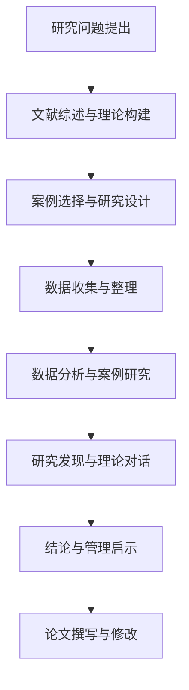

# 第一章 绪论

## 1.1 研究背景

### 1.1.1 视觉力学传感器行业发展现状与趋势

视觉力学传感器作为机器视觉与力学测量技术交叉融合的前沿领域，正成为智能制造、工业检测、结构健康监测等关键应用的核心技术。数字图像相关（Digital Image Correlation, DIC）技术作为视觉力学传感器的核心技术，通过非接触式测量方式，实现了对材料变形、应变分布的高精度全场测量。

根据行业研究报告显示，全球DIC视觉传感器市场规模在2024年已达到XX亿元，预计到2031年将增长至XX亿元，年复合增长率（CAGR）达到XX%。中国作为全球制造业中心，在视觉力学传感器领域展现出强劲的增长势头，2024年中国市场规模约占全球的35%，成为全球最大的单一市场。

### 1.1.2 数字化转型对传感器行业的影响

随着工业4.0和智能制造战略的深入推进，传统传感器行业正面临深刻的数字化转型挑战。数字化转型不仅改变了传感器的技术形态，更重塑了企业的商业模式和竞争格局。视觉力学传感器企业需要在以下方面应对转型压力：

1. **技术融合创新**：人工智能、大数据、云计算等新一代信息技术与传感器技术的深度融合，催生了智能传感器、边缘计算传感器等新产品形态。

2. **商业模式变革**：从传统的设备销售向"硬件+软件+服务"的一体化解决方案转型，价值创造重心从产品制造向数据服务转移。

3. **产业生态重构**：传感器企业需要与上下游企业、科研院所、平台企业等构建开放创新的产业生态系统。

### 1.1.3 HSM公司在行业中的定位与挑战

深圳市海塞姆科技有限公司（以下简称HSM）成立于2020年6月，是一家以机器视觉技术为核心的科技创新型企业。公司自成立以来一直坚持全自主知识产权研发，致力于将先进的机器视觉技术赋能应用于传感器领域，目前已成为全球领先的DIC视觉传感技术方案提供商。

HSM公司在行业中具有以下独特定位：
- **技术领先优势**：拥有全球首创的第三代DIC技术，实现了从单目三维DIC算法到标准化产品的突破
- **全栈技术能力**：具备从算法、软件到系统、框架、上层应用支持的全栈技术实力
- **市场先发优势**：在DIC视觉传感器领域专利申请量居全国第一，服务客户超过1000家

然而，HSM公司在快速发展过程中也面临一系列挑战：
- **市场竞争加剧**：国内外竞争对手在技术追赶和市场渗透方面的压力日益增大
- **技术迭代加速**：人工智能、大模型等新技术对传统DIC技术路径的冲击
- **规模化扩张瓶颈**：如何从技术领先企业向规模化、平台化企业转型
- **国际化拓展挑战**：在全球市场建立品牌影响力和渠道网络

## 1.2 研究意义

### 1.2.1 理论意义

本研究从企业战略转型理论视角，深入分析视觉力学传感器企业的转型动因、实施路径和成效评估，具有以下理论意义：

1. **丰富战略转型理论在硬科技领域的应用**：现有战略转型研究多集中在传统制造业和服务业，对硬科技企业的转型研究相对不足。本研究通过HSM案例，探讨硬科技企业战略转型的特殊性和规律性。

2. **拓展动态能力理论的实证研究**：从动态能力视角分析HSM如何通过技术吸收、资源重构、组织学习等过程，构建和维持竞争优势。

3. **完善技术创新与战略转型的整合框架**：探索技术创新驱动下的战略转型机制，为技术密集型企业的战略管理提供理论参考。

### 1.2.2 实践意义

本研究对视觉力学传感器企业及相关硬科技企业具有重要的实践指导意义：

1. **为企业战略转型提供参考路径**：通过HSM的实践经验，为同类企业制定和实施战略转型提供可借鉴的路径和方法。

2. **为创新型企业成长提供管理启示**：探索技术驱动型企业在不同发展阶段面临的战略选择和管理挑战。

3. **为产业政策制定提供决策支持**：为政府部门制定支持硬科技企业创新发展的政策提供案例参考和数据支撑。

### 1.2.3 政策意义

本研究对政府制定科技创新和产业升级政策具有参考价值：

1. **优化创新支持政策**：基于硬科技企业的实际需求，提出更加精准有效的创新支持政策建议。

2. **促进产学研用深度融合**：探索构建更加高效的产学研用合作机制，加速科技成果转化。

3. **推动产业集群发展**：为视觉力学传感器等战略性新兴产业集群发展提供路径指引。

## 1.3 研究内容与方法

### 1.3.1 研究内容框架

本研究围绕"视觉力学传感器企业战略转型"这一核心主题，以HSM公司为案例研究对象，主要研究内容包括：

1. **HSM公司战略转型的动因分析**：从外部环境和内部资源两个维度，分析HSM战略转型的驱动因素和紧迫性。

2. **HSM战略转型的实施路径研究**：深入剖析HSM在技术战略、市场战略、组织架构和数字化转型等方面的具体举措。

3. **HSM战略转型的成效评估**：从财务绩效、市场地位、创新能力和可持续发展四个维度评估转型成效。

4. **经验总结与管理启示**：总结HSM战略转型的成功经验和不足，提出对同类企业的管理启示和政策建议。

### 1.3.2 研究方法

本研究采用多元化的研究方法，确保研究的科学性和可靠性：

1. **案例研究法**：以HSM公司为典型案例，通过深入访谈、文档分析、参与观察等方式，获取第一手研究资料。

2. **文献分析法**：系统收集和梳理企业战略转型、视觉力学传感器行业、技术创新管理等相关文献，构建理论基础。

3. **比较分析法**：将HSM与行业主要竞争对手进行比较分析，识别其竞争优势和不足。

4. **数据分析法**：对收集的定量数据（财务数据、市场数据、专利数据等）进行统计分析，验证研究假设。

### 1.3.3 技术路线图

本研究的技术路线图如下：

## 1.4 论文结构安排

本论文共分为七章，各章主要内容如下：

**第一章 绪论**：介绍研究背景、意义、内容与方法，明确研究框架。

**第二章 理论基础与文献综述**：梳理企业战略转型、视觉力学传感器行业、相关研究进展等理论基础。

**第三章 HSM公司概况与行业环境分析**：介绍HSM发展历程，分析行业环境和竞争格局。

**第四章 HSM战略转型的动因分析**：从内外两个维度分析战略转型的驱动因素。

**第五章 HSM战略转型的实施路径**：详细研究技术、市场、组织、数字化四个维度的转型举措。

**第六章 HSM战略转型的成效评估**：从多维度评估转型成效，分析成功经验和不足。

**第七章 结论与建议**：总结研究结论，提出管理启示和政策建议。

---

**本章小结**：本章作为论文的开篇，明确了研究背景和意义，界定了研究内容和范围，介绍了研究方法和论文结构，为后续研究奠定了坚实基础。